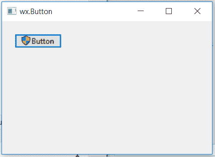

# wx 中的 wxPython–GetauthNeedd()函数。按钮

> 原文:[https://www . geesforgeks . org/wxpython-getauthused-function-in-wx-button/](https://www.geeksforgeeks.org/wxpython-getauthneeded-function-in-wx-button/)

在本文中，我们将了解与 wx 相关联的 GetAuthNeeded()函数。wxPython 的按钮类。函数的作用是:当按钮上显示需要认证的符号时，返回真。
不需要争论。

> **语法:** wx。按钮。获取所需的(自我)
> 
> **参数:**getauthneedd()函数不需要参数。
> 
> **返回类型:** bool

**代码示例:**

```py
import wx

class Example(wx.Frame):

    def __init__(self, *args, **kwargs):
        super(Example, self).__init__(*args, **kwargs)

        self.InitUI()

    def InitUI(self):
        self.pnl = wx.Panel(self)
        self.btn = wx.Button(self.pnl, label ='Button', pos =(20, 20))
        self.btn.SetAuthNeeded(True)

        # PRINT IF AUTHENTICATION IS NEEDED OR NOT USING GetAuthNeeded()
        if(self.btn.GetAuthNeeded()== True):
            print("Authentication is needed.")
        else:
            print("No Authentication is needed.")
        self.SetSize((350, 250))
        self.SetTitle('wx.Button')
        self.Centre()

def main():
    app = wx.App()
    ex = Example(None)
    ex.Show()
    app.MainLoop()

if __name__ == '__main__':
    main()
```

**控制台输出:**

```py
Authentication is needed.

```

**输出窗口:**
