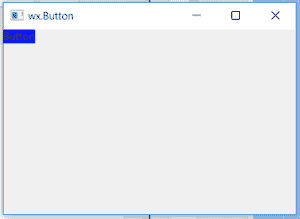

# wx xpython–wx 中的 GetBackgroundColour()函数。StaticText

> 原文:[https://www . geesforgeks . org/wxpython-getbackground color-function-in-wx-static text/](https://www.geeksforgeeks.org/wxpython-getbackgroundcolour-function-in-wx-statictext/)

在本文中，我们将学习与 wx 相关联的 GetBackgroundColor()函数。wxPython 静态文本类。函数的作用是:返回静态文本背景的颜色。颜色的格式是(R，G，B，A)。
getbackground color()函数中不需要参数。

> **语法:** wx。static text . getbackground color(self)
> 
> **参数:**GetBackgroundColor()函数不需要参数。
> 
> **返回类型:** wx。颜色

**代码示例:**

```
import wx

class Example(wx.Frame):

    def __init__(self, *args, **kwargs):
        super(Example, self).__init__(*args, **kwargs)
        self.InitUI()

    def InitUI(self):
        self.locale = wx.Locale(wx.LANGUAGE_ENGLISH)

        # create parent panel
        self.pnl = wx.Panel(self)

        # create statictext at point (20, 20)
        self.st = wx.StaticText(self.pnl, id = 1, label ="Button")

        # change background colour of statictext
        self.st.SetBackgroundColour((10, 20, 255, 255))

        # get background colour
        bc = self.st.GetBackgroundColour()

        # print background colour
        print(bc)

        self.SetSize((350, 250))
        self.SetTitle('wx.Button')
        self.Centre()

def main():
    app = wx.App()
    ex = Example(None)
    ex.Show()
    app.MainLoop()

if __name__ == '__main__':
    main()
```

**控制台输出:**
(10，20，255，255)

**输出窗口:**
