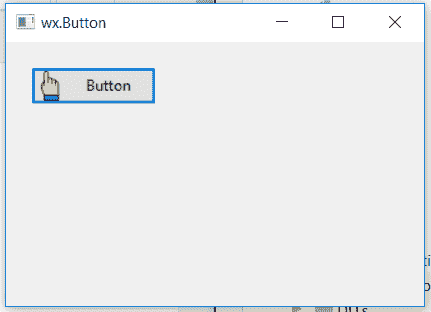

# wx 中的 wxPython–GetBitmap()函数。按钮

> 原文:[https://www . geesforgeks . org/wxpython-getbitmap-function-in-wx-button/](https://www.geeksforgeeks.org/wxpython-getbitmap-function-in-wx-button/)

在本文中，我们将了解与 wx 相关联的 GetBitmap()函数。wxPython 的按钮类。GetBitmap()函数只是用来返回按钮所显示的位图。

仅当按钮不显示任何图像时，返回的位图才可能无效

> **语法:** wx。获取位图(自身)
> 
> **参数:**GetBitmap()函数中没有参数。
> 
> **返回类型:** wx。位图

**代码示例:**

```
import wx

class Example(wx.Frame):

    def __init__(self, *args, **kwargs):
        super(Example, self).__init__(*args, **kwargs)
        self.InitUI()

    def InitUI(self):
        self.locale = wx.Locale(wx.LANGUAGE_ENGLISH)

        # create parent panel for button
        self.pnl = wx.Panel(self)

        # create wx.Bitmap object 
        bmp = wx.Bitmap('pointer.png')

        # create button at point (20, 20)
        self.st = wx.Button(self.pnl, id = 1, label ="Button", pos =(20, 20),
                                          size =(100, 30),  name ="button")

        # set bmp as bitmap for button
        self.st.SetBitmap(bmp)

        # get wx.Bitmap object
        bmap = self.st.GetBitmap()

        # print depth of bitmap
        print(bmp.Depth)

        self.SetSize((350, 250))
        self.SetTitle('wx.Button')
        self.Centre()

def main():
    app = wx.App()
    ex = Example(None)
    ex.Show()
    app.MainLoop()

if __name__ == '__main__':
    main()
```

**控制台输出:**

```
32

```

**输出窗口:**
