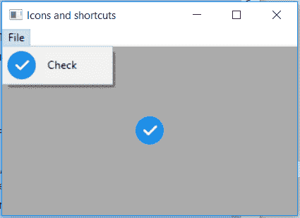

# wx python–wx 中的 GetBitmap()函数。MenuItem

> 哎哎哎:# t0]https://www . geeksforgeeks . org/wx python-getbitmap-function-in-wx-menu item/

在本文中，我们将了解与 wx 相关联的 GetBitmap()函数。wxPython 的 MenuItem 类。函数的作用是:返回选中或未选中的位图。它采用单个布尔类型参数，如果选中则为真，如果未选中则为假。

> **语法:** wx。位图(自身，选中=真)
> 
> **参数:**
> 
> | 参数 | 输入类型 | 描述 |
> | --- | --- | --- |
> | 检查 | 弯曲件 | 选中时为真，未选中时为假。 |
> 
> **返回类型:** wx。位图

**Code Example :**

```py
import wx

class Example(wx.Frame):

    def __init__(self, *args, **kwargs):
        super(Example, self).__init__(*args, **kwargs)

        self.InitUI()

    def InitUI(self):
        self.locale = wx.Locale(wx.LANGUAGE_ENGLISH)

        self.menubar = wx.MenuBar()
        self.fileMenu = wx.Menu()
        self.item = wx.MenuItem(self.fileMenu, 1, '&Check')
        self.item.SetBitmap(wx.Bitmap('right.png'))
        self.fileMenu.Append(self.item)

        # get bitmap from menuitem
        bmp = self.item.GetBitmap(checked = True) 

        # show static bitmap in frame
        self.sbmp = wx.StaticBitmap(self, id = 3, bitmap = bmp, pos =(20, 20),
                                    size =(32, 32), style = 0, name ="static")

        self.menubar.Append(self.fileMenu, '&File')
        self.SetMenuBar(self.menubar)

        self.SetSize((350, 250))
        self.SetTitle('Icons and shortcuts')
        self.Centre()

def main():
    app = wx.App()
    ex = Example(None)
    ex.Show()
    app.MainLoop()

if __name__ == '__main__':
    main()
```

**输出:**
