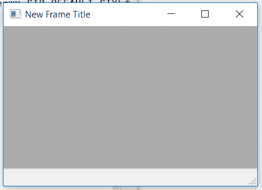

# wx 中的 wxPython–GetBorders()函数。状态栏

> 原文:[https://www . geesforgeks . org/wxpython-get borders-function-in-wx-status bar/](https://www.geeksforgeeks.org/wxpython-getborders-function-in-wx-statusbar/)

在本文中，我们将学习与 wx 相关联的 GetBorders()函数。wxPython 的 StatusBar 类。GetBorders()函数返回在字段区域内呈现字段文本时使用的水平和垂直边框。

请注意，GetFieldRect 返回的 rect 已经说明了该函数返回的水平和垂直边框的存在。

> **语法:** wx。StatusBar.GetBorders(自身)
> 
> **参数:**GetBorders()函数不需要参数。

**代码示例:**

```
import wx

class Example(wx.Frame):

    def __init__(self, *args, **kwargs):
        super(Example, self).__init__(*args, **kwargs)

        self.InitUI()

    def InitUI(self):

        self.locale = wx.Locale(wx.LANGUAGE_ENGLISH)
        self.statusbar = wx.StatusBar()
        self.statusbar.Create(self, id = 1, style = wx.STB_DEFAULT_STYLE,
                                                     name = "Status Bar")
        self.SetStatusBar(self.statusbar)
        self.SetSize((350, 250))

        # PRINT THE RETURNED wx.Size OBJECT 
        print(self.statusbar.GetBorders())
        self.SetTitle('New Frame Title')
        self.Centre()

def main():
    app = wx.App()
    ex = Example(None)
    ex.Show()
    app.MainLoop()

if __name__ == '__main__':
    main()
```

**输出:**
