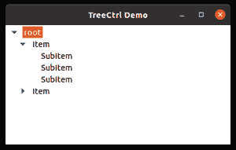
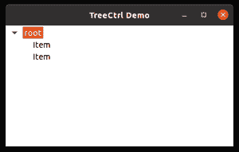

# wx python–wx 中的 GetCount()方法。tree ctrl〔t1〕

> 哎哎哎:# t0]https://www . geeksforgeeks . org/wx python-get count-method-in-wx-tree ctrl/

下面的文章讨论了与 wx 相关联的 GetCount()方法。wxPython 的 TreeCtrl 类。GetCount()方法用于获取控件中存在的项的总数。

> **语法:** wx。TreeCtrl.GetCount(自我)
> 
> **参数:**
> 
> 此方法不需要任何参数。
> 
> **返回:**
> 
> 它返回一个整数，即控件中的项数。

下面描述了如何实现它来产生一些功能:

**例 1:**

## 计算机编程语言

```
import wx

class MyTree(wx.TreeCtrl):

    def __init__(self, parent, id, pos, size, style):
        wx.TreeCtrl.__init__(self, parent, id, pos, size, style)

class TreePanel(wx.Panel):

    def __init__(self, parent):
        wx.Panel.__init__(self, parent)
        # create tree control in window
        self.tree = MyTree(self, wx.ID_ANY, wx.DefaultPosition, wx.DefaultSize,
                           wx.TR_HAS_BUTTONS)
        # CREATE TREE ROOT
        self.root = self.tree.AddRoot('root')
        self.tree.SetPyData(self.root, ('key', 'value'))

        # add item to root
        item = self.tree.AppendItem(self.root, "Item")
        item2 = self.tree.AppendItem(self.root, "Item")
        item3 = self.tree.AppendItem(item, "SubItem")
        item4 = self.tree.AppendItem(item, "SubItem")
        item5 = self.tree.AppendItem(item2, "SubItem")
        item6 = self.tree.AppendItem(item, "SubItem")

        # expand root node
        print(self.tree.GetCount())

        # expand all nodes of the tree
        self.tree.ExpandAllChildren(item)

        sizer = wx.BoxSizer(wx.VERTICAL)
        sizer.Add(self.tree, 100, wx.EXPAND)
        self.SetSizer(sizer)

class MainFrame(wx.Frame):

    def __init__(self):
        wx.Frame.__init__(self, parent=None, title='TreeCtrl Demo')
        panel = TreePanel(self)
        self.Show()

if __name__ == '__main__':
    app = wx.App(redirect=False)
    frame = MainFrame()
    app.MainLoop()

class MyTree(wx.TreeCtrl):

    def __init__(self, parent, id, pos, size, style):
        wx.TreeCtrl.__init__(self, parent, id, pos, size, style)

class TreePanel(wx.Panel):

    def __init__(self, parent):
        wx.Panel.__init__(self, parent)
        # create tree control in window
        self.tree = MyTree(self, wx.ID_ANY, wx.DefaultPosition, wx.DefaultSize,
                           wx.TR_HAS_BUTTONS)
        # CREATE TREE ROOT
        self.root = self.tree.AddRoot('root')
        self.tree.SetPyData(self.root, ('key', 'value'))

        # add item to root
        item = self.tree.AppendItem(self.root, "Item")
        item2 = self.tree.AppendItem(self.root, "Item")
        item3 = self.tree.AppendItem(item, "SubItem")
        item4 = self.tree.AppendItem(item, "SubItem")
        item5 = self.tree.AppendItem(item2, "SubItem")
        item6 = self.tree.AppendItem(item, "SubItem")

        # print total items in treectrl
        print(self.tree.GetCount())

        # expand all nodes of the tree
        self.tree.ExpandAllChildren(item)

        sizer = wx.BoxSizer(wx.VERTICAL)
        sizer.Add(self.tree, 100, wx.EXPAND)
        self.SetSizer(sizer)

class MainFrame(wx.Frame):

    def __init__(self):
        wx.Frame.__init__(self, parent=None, title='TreeCtrl Demo')
        panel = TreePanel(self)
        self.Show()

if __name__ == '__main__':
    app = wx.App(redirect=False)
    frame = MainFrame()
    app.MainLoop()
```

**输出:**

> seven



**例 2:**

## 计算机编程语言

```
import wx

class MyTree(wx.TreeCtrl):

    def __init__(self, parent, id, pos, size, style):
        wx.TreeCtrl.__init__(self, parent, id, pos, size, style)

class TreePanel(wx.Panel):

    def __init__(self, parent):
        wx.Panel.__init__(self, parent)
        # create tree control in window
        self.tree = MyTree(self, wx.ID_ANY, wx.DefaultPosition, wx.DefaultSize,
                           wx.TR_HAS_BUTTONS)
        # CREATE TREE ROOT
        self.root = self.tree.AddRoot('root')
        self.tree.SetPyData(self.root, ('key', 'value'))

        # add item to root
        item = self.tree.AppendItem(self.root, "Item")
        item2 = self.tree.AppendItem(self.root, "Item")

        # print number of items in treectrl
        print(self.tree.GetCount())

        # expand all nodes of the tree
        self.tree.ExpandAllChildren(item)

        sizer = wx.BoxSizer(wx.VERTICAL)
        sizer.Add(self.tree, 100, wx.EXPAND)
        self.SetSizer(sizer)

class MainFrame(wx.Frame):

    def __init__(self):
        wx.Frame.__init__(self, parent=None, title='TreeCtrl Demo')
        panel = TreePanel(self)
        self.Show()

if __name__ == '__main__':
    app = wx.App(redirect=False)
    frame = MainFrame()
    app.MainLoop()
```

**输出:**

> three

