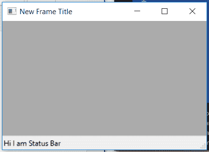

# wx Tyson–wx 中的 GetField()函数函数。状态栏

> 原文:[https://www . geesforgeks . org/wxpython-getfield-function-function-in-wx-status bar/](https://www.geeksforgeeks.org/wxpython-getfield-function-function-in-wx-statusbar/)

在本文中，我们将了解与 wx 相关联的 GetField()函数。wxPython 的 GetField()类。函数返回 wx。StatusBarPane 表示第 n 个字段。

只需要一个参数，即状态栏中的字段编号。

> **语法:** wx。StatusBar.GetField(自我，n)
> 
> **参数:**
> 
> | 参数 | 输入类型 | 描述 |
> | --- | --- | --- |
> | n | （同 Internationalorganizations）国际组织 | 状态栏中的字段编号。 |

**代码示例:**

```
import wx

class Example(wx.Frame):

    def __init__(self, *args, **kwargs):
        super(Example, self).__init__(*args, **kwargs)

        self.InitUI()

    def InitUI(self):

        self.locale = wx.Locale(wx.LANGUAGE_ENGLISH)
        self.statusbar = wx.StatusBar()
        self.statusbar.Create(self, id = 1, style = wx.STB_DEFAULT_STYLE,
                                                      name = "Status Bar")

        self.SetStatusBar(self.statusbar)
        self.SetSize((350, 250))
        self.statusbar.SetStatusText("Hi I am Status Bar")

        # GET wx.StatusBarPane OBJECT
        field = self.statusbar.GetField(0)

        # PRINT TEXT
        print(field.Text)

        # PRINT STYLE IDENTIFIER
        print(field.Style)
        print(field.Width)
        self.SetTitle('New Frame Title')
        self.Centre()

def main():
    app = wx.App()
    ex = Example(None)
    ex.Show()
    app.MainLoop()

if __name__ == '__main__':
    main()
```

**控制台输出:**

```
Hi I am Status Bar
0
0

```

**输出窗口:**
