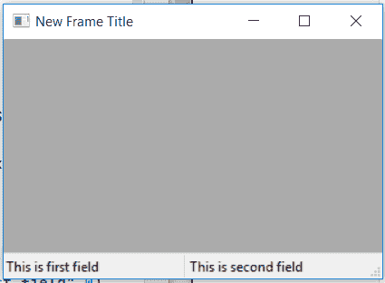

# wx python–getfieldscount()wx 中的函数。状态栏〔t1〕

> 原文:[https://www . geesforgeks . org/wxpython-getfield scount-function-in-wx-status bar/](https://www.geeksforgeeks.org/wxpython-getfieldscount-function-in-wx-statusbar/)

在本文中，我们将了解与 wx 相关联的 GetFieldsCount()函数。wxPython 的 StatusBar 类。GetFieldCount()函数只是用来返回状态栏中的字段数。它以 int 格式返回总字段。

GetFieldsCount()函数中不需要参数。

> **语法:** wx。StatusBar.GetFieldsCount(自我)
> 
> **参数:**getfield scount()函数中不需要参数。
> 
> **返回类型:** int

**代码示例:**

```py
import wx

class Example(wx.Frame):

    def __init__(self, *args, **kwargs):
        super(Example, self).__init__(*args, **kwargs)

        self.InitUI()

    def InitUI(self):

        self.locale = wx.Locale(wx.LANGUAGE_ENGLISH)
        self.statusbar = wx.StatusBar()
        self.statusbar.Create(self, id = 1, style = wx.STB_DEFAULT_STYLE, 
                                                      name = "Status Bar")

        self.SetStatusBar(self.statusbar)
        self.SetSize((350, 250))
        self.statusbar.SetFieldsCount(2)
        self.statusbar.SetStatusWidths([150, 150])
        self.statusbar.SetStatusText("This is first field", 0)
        self.statusbar.SetStatusText("This is second field", 1)

        # GET TOTAL FIELDS IN STATUSBAR
        tot = self.statusbar.GetFieldsCount()
        # PRINT TOTAL FIELDS
        print(tot)

        self.SetTitle('New Frame Title')
        self.Centre()

def main():
    app = wx.App()
    ex = Example(None)
    ex.Show()
    app.MainLoop()

if __name__ == '__main__':
    main()
```

**控制台输出:**

```py
2

```

**输出窗口:**
