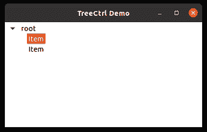

# wx 中的 wxPython–getfocused item()方法。TreeCtrl

> 原文:[https://www . geesforgeks . org/wxpython-getfocusdeitem-method-in-wx-tree ctrl/](https://www.geeksforgeeks.org/wxpython-getfocuseditem-method-in-wx-treectrl/)

在本文中，我们将学习与 *wx 相关联的 *GetFocusedItem()* 方法。 *wxPython* 模块的 TreeCtrl* 类。使用 *GetFocusedItem()* 功能返回聚焦的项目。它返回上次单击或选择的项目。 *GetFocusedItem()* 方法不需要参数。

与 *GetSelection()* 不同，无论控件是否具有 *TR_MULTIPLE* 样式，都可以使用。

**语法:**

> wx(地名)。TreeCtrl.GetFocusedItem(自我)
> 
> **返回类型:** wx。TreeItemId
> 
> **参数:**无参数

**在下面的程序中，我们将返回项目是否有效。还有，** ***wx。返回*** **对象。**

## 计算机编程语言

```py
# import required modules
import wx

class MyTree(wx.TreeCtrl):

    def __init__(self, parent, id, pos, size, style):
        wx.TreeCtrl.__init__(self, parent, id, pos, size, style)

class TreePanel(wx.Panel):

    def __init__(self, parent):
        wx.Panel.__init__(self, parent)

    # create tree control in window
        self.tree = MyTree(self, wx.ID_ANY, wx.DefaultPosition, wx.DefaultSize,
                           wx.TR_HAS_BUTTONS)

        # create tree root
        self.root = self.tree.AddRoot('root')
        self.tree.SetPyData(self.root, ('key', 'value'))

        # add item to root
        item = self.tree.AppendItem(self.root, "Item")
        item2 = self.tree.AppendItem(self.root, "Item")

        # set focused/selected item in control
        self.tree.SetFocusedItem(item)

        # print if first visible item is
        # a valid tree item
        if(self.tree.GetFocusedItem().IsOk()):
            print("Valid Item")
            print(self.tree.GetFocusedItem())
        else:
            print("Invalid Item")

        sizer = wx.BoxSizer(wx.VERTICAL)
        sizer.Add(self.tree, 100, wx.EXPAND)
        self.SetSizer(sizer)

class MainFrame(wx.Frame):

    def __init__(self):
        wx.Frame.__init__(self, parent=None, title='TreeCtrl Demo')
        panel = TreePanel(self)
        self.Show()

# Driver Code
if __name__ == '__main__':
    app = wx.App(redirect=False)
    frame = MainFrame()
    app.MainLoop()
```

**输出:**

```py
Valid Item
<wx._core.TreeItemId object at 0x000001DAED4141F8>
```

