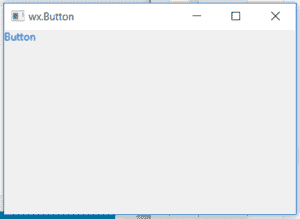

# wx xpython–wx 中的 GetForegroundColour()函数。StaticText

> 原文:[https://www . geeksforgeeks . org/wxpython-getforegroundcolour-function-in-wx-static text/](https://www.geeksforgeeks.org/wxpython-getforegroundcolour-function-in-wx-statictext/)

在本文中，我们将学习与 wx 相关的`GetForegroundColour()`函数。wxPython 静态文本类。`GetForegroundColour()`函数返回用于静态文本字体或前景的颜色。颜色的格式为(红、绿、蓝、蓝)。`GetForegroundColour()`功能不需要参数。

> **语法:**
> wx。StaticText.GetForegroundColour(自我)
> 
> **参数:**
> GetForegroundColour()函数不需要参数。
> 
> **返回类型:**
> wx。颜色

**代码示例:**

```py
# importing the module
import wx

# definition of the Example class
class Example(wx.Frame):

    # instantiating the class
    def __init__(self, *args, **kwargs):
        super(Example, self).__init__(*args, **kwargs)

        self.InitUI()

    # method for creation of user interface
    def InitUI(self):
        self.locale = wx.Locale(wx.LANGUAGE_ENGLISH)

        # create parent panel for button
        self.pnl = wx.Panel(self)

        # create button at point (20, 20)
        self.st = wx.StaticText(self.pnl, id = 1, label ="Button")

        # change foreground colour of button
        self.st.SetForegroundColour((10, 20, 255, 255))

        # get foreground colour
        fc = self.st.GetForegroundColour()

        # print foreground colour
        print(fc)

        self.SetSize((350, 250))
        self.SetTitle('wx.Button')
        self.Centre()

# definition of the main function
def main():

    # creating an App object
    app = wx.App()

    # creating an Example object
    ex = Example(None)

    # showing the Example object
    ex.Show()

    # running the App object
    app.MainLoop()

# driver code
if __name__ == '__main__':
    main()
```

**控制台输出:**

```py
(10, 20, 255, 255)
```

**输出窗口:**
