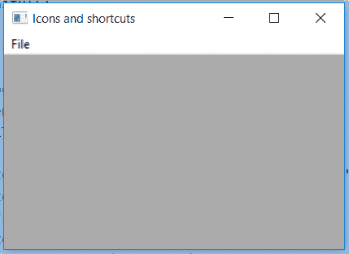
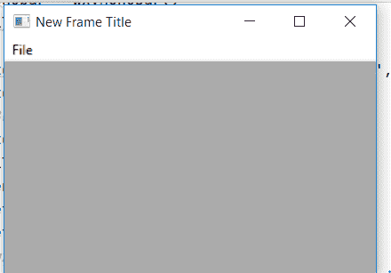

# wx 的 wxPython–GetFrame()函数。菜单栏

> 原文:[https://www . geesforgeks . org/wxpython-getframe-function-of-wx-menu bar/](https://www.geeksforgeeks.org/wxpython-getframe-function-of-wx-menubar/)

在本文中，我们将学习与 wx 相关联的 GetFrame()函数。wxPython 的菜单栏类。函数的作用是:获取菜单栏的父框架。我们可以操纵框架。
GetFrame()函数中不需要参数

> **语法:** wx。菜单栏获取框架(自身)
> 
> **参数:**GetFrame()函数中不需要参数

**代码示例#1:**

```py
import wx

class Example(wx.Frame):

    def __init__(self, *args, **kwargs):
        super(Example, self).__init__(*args, **kwargs)

        self.InitUI()

    def InitUI(self):

        self.locale = wx.Locale(wx.LANGUAGE_ENGLISH)
        self.menubar = wx.MenuBar()
        self.fileMenu = wx.Menu()

        self.item = wx.MenuItem(self.fileMenu, 1, '&Check',
                                  helpString ="Check Help")
        self.item.SetBitmap(wx.Bitmap('right.png'))

        # SET BLUE COLOUR FOR TEXT FORMAT(R, B, G, A)
        self.item.SetTextColour((79, 81, 230, 255))
        self.fileMenu.Append(self.item)
        self.menubar.Append(self.fileMenu, '&File')
        self.SetMenuBar(self.menubar)
        self.SetSize((350, 250))
        self.SetTitle('Icons and shortcuts')
        self.Centre()

        # GET wx.Frame OBJECT
        frame = self.menubar.GetFrame()

        # PRINT TITLE OF frame
        print(frame.GetTitle())
def main():
    app = wx.App()
    ex = Example(None)
    ex.Show()
    app.MainLoop()

if __name__ == '__main__':
    main()
```

**输出窗口:**


**控制台输出:**

```py
Icons and shortcuts

```

**代码示例#2:**

```py
import wx

class Example(wx.Frame):

    def __init__(self, *args, **kwargs):
        super(Example, self).__init__(*args, **kwargs)

        self.InitUI()

    def InitUI(self):

        self.locale = wx.Locale(wx.LANGUAGE_ENGLISH)
        self.menubar = wx.MenuBar()
        self.fileMenu = wx.Menu()

        self.item = wx.MenuItem(self.fileMenu, 1, '&Check', 
                                  helpString ="Check Help")
        self.item.SetBitmap(wx.Bitmap('right.png'))

        # SET BLUE COLOUR FOR TEXT FORMAT(R, B, G, A)
        self.item.SetTextColour((79, 81, 230, 255))
        self.fileMenu.Append(self.item)
        self.menubar.Append(self.fileMenu, '&File')
        self.SetMenuBar(self.menubar)
        self.SetSize((350, 250))

        # GET wx.Frame OBJECT
        frame = self.menubar.GetFrame()
        # SET NEW TITLE FOR FRAME
        frame.SetTitle('New Frame Title')
        self.Centre()

def main():
    app = wx.App()
    ex = Example(None)
    ex.Show()
    app.MainLoop()

if __name__ == '__main__':
    main()
```

**输出:**
