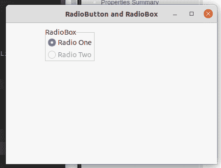

# wx python–getitemfrompoint()函数在 wx 中。收音机盒〔t1〕

> 哎哎哎:# t0]https://www . geeksforgeeks . org/wx python-getitemfrompoint-function-in-wx-radio box/

在本文中，我们将学习与 wx 相关联的 GetItemFromPoint()函数。wxPython 的 RadioBox 类。函数的作用是:简单地返回点下的一个单选框项，一个从零开始的项索引，如果点下没有项，则返回 NOT_FOUND。

它以客户点为参数。

> **语法:** wx。RadioBox.GetItemFromPoint(自我、pt)
> 
> **参数:**
> 
> | 参数 | 输入类型 | 描述 |
> | --- | --- | --- |
> | 元素铂的符号 | wx。要点 | 指向客户坐标。 |
> 
> **返回类型:** int

**代码示例:**

```py
import wx

class FrameUI(wx.Frame):

    def __init__(self, parent, title):
        super(FrameUI, self).__init__(parent, title = title, size =(300, 200))

        # function for in-frame components
        self.InitUI()

    def InitUI(self):
        # parent panel for radio box
        pnl = wx.Panel(self)

        # list of choices
        lblList = ['Radio One', 'Radio Two']

        # create radio boc containing above list
        self.rbox = wx.RadioBox(pnl, label ='RadioBox', pos =(80, 10), choices = lblList,
                                         majorDimension = 1, style = wx.RA_SPECIFY_COLS)

        # print item at point (80, 30)
        print (self.rbox.GetItemFromPoint((80, 30)))

        # set frame in centre
        self.Centre()
        # set size of frame
        self.SetSize((400, 250))
        # show output frame
        self.Show(True)

# wx App instance
ex = wx.App()
# Example instance
FrameUI(None, 'RadioButton and RadioBox')
ex.MainLoop()
```

**控制台输出:**

```py
0

```

**输出窗口:**
