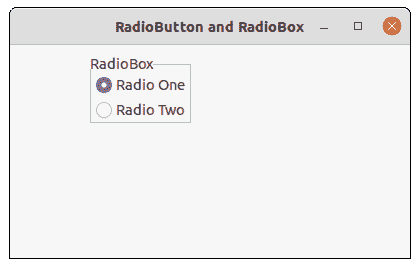

# wxppython–getitem tooltip()方法(在 wx 中)。收音机盒〔t1〕

> 哎哎哎:# t0]https://www . geeksforgeeks . org/wx python-getitem tooltip-method-in-wx-radio box/

在本文中，我们将了解与 wx 相关联的 getitemtoltitle()函数。wxPython 的 RadioBox 类。GetItemToolTip()是一个简单的函数，用于返回与指定项相关联的工具提示(如果有)或无。

它获取我们想要查找其工具提示的项目的索引。

> **语法:** wx。RadioBox.GetItemToolTip(自我、项目)
> 
> **参数**
> 
> | 参数 | 输入类型 | 描述 |
> | --- | --- | --- |
> | 项目 | （同 Internationalorganizations）国际组织 | 从零开始的索引。 |
> 
> **返回类型:** wx。工具提示

**代码示例:**

```py
import wx

class FrameUI(wx.Frame):

    def __init__(self, parent, title):
        super(FrameUI, self).__init__(parent, title = title, size =(300, 200))

        # function for in-frame components
        self.InitUI()

    def InitUI(self):
        # parent panel for radio box
        pnl = wx.Panel(self)

        # list of choices
        lblList = ['Radio One', 'Radio Two']

        # create radio boc containing above list
        self.rbox = wx.RadioBox(pnl, label ='RadioBox', pos =(80, 10), choices = lblList,
                                         majorDimension = 1, style = wx.RA_SPECIFY_COLS)

        # set tooltip for first tool
        self.rbox.SetItemToolTip(0, "Item One")

        # create object for wx.ToolTip
        tip = self.rbox.GetItemToolTip(0)

        # print tooltip text associated with item index 0
        print (tip.GetTip())

        # set frame in centre
        self.Centre()
        # set size of frame
        self.SetSize((400, 250))
        # show output frame
        self.Show(True)

# wx App instance
ex = wx.App()
# Example instance
FrameUI(None, 'RadioButton and RadioBox')
ex.MainLoop()
```

**控制台输出:**

```py
Item One

```

**输出窗口:**
