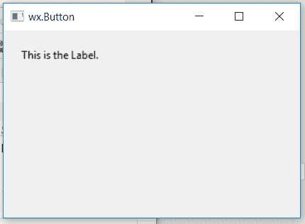

# wx 中的 wxPython–GetLabel()函数。StaticText

> 原文:[https://www . geesforgeks . org/wxpython-getlabel-function-in-wx-static text/](https://www.geeksforgeeks.org/wxpython-getlabel-function-in-wx-statictext/)

在本文中，我们将了解与 wx 相关联的 GetLabel()函数。wxPython 的 StaticText 类。GetLabel()函数是一个重要的函数，它用来获取与 wxPython 关联的字符串标签。它返回一个字符串。

GetLabel()函数中不需要参数。

> **语法：** wx.StaticText.GetLabel（self， label）
> 
> **参数:**GetLabel()函数不需要参数。
> 
> **返回类型:**字符串

**代码示例:**

```py
import wx

class Example(wx.Frame):

    def __init__(self, *args, **kwargs):
        super(Example, self).__init__(*args, **kwargs)
        self.InitUI()

    def InitUI(self):
        self.locale = wx.Locale(wx.LANGUAGE_ENGLISH)
        self.pnl = wx.Panel(self)

        bmp = wx.Bitmap('right.png')
        # CREATE STATICTEXT AT POINT (20, 20)
        self.st = wx.StaticText(self.pnl, id = 1, label ="This is the Label.", pos =(20, 20),
                                size = wx.DefaultSize, style = wx.ST_ELLIPSIZE_MIDDLE, name ="statictext")

        self.st.SetBackgroundColour((255, 252, 92, 255))
        self.st.SetForegroundColour((14, 96, 150, 255))

        # PRINT LABEL OF STATICTEXT
        print(self.st.GetLabel())

        self.SetSize((350, 250))
        self.SetTitle('wx.Button')
        self.Centre()

def main():
    app = wx.App()
    ex = Example(None)
    ex.Show()
    app.MainLoop()

if __name__ == '__main__':
    main()
```

**控制台输出:**

```py
This is the Label.

```

**输出窗口:**
