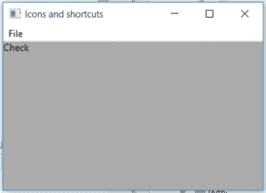

# wxPython–wxPython

中的 GetLabelText()函数

> 原文:[https://www . geeksforgeeks . org/wxpython-getlabeltext-function-in-wxpython/](https://www.geeksforgeeks.org/wxpython-getlabeltext-function-in-wxpython/)

在本文中，我们将学习与 wx 相关联的 GetLabelText()函数。wxPython 的 MenuItem 类。函数的作用是:从给定的文本中去掉所有的快捷键字符和助记符。
**例如:**
wx。
将只返回“你好”。

将未换行的文本作为参数。

> **语法:**
> 
> ```py
> wx.MenuItem.GetLabelText()
> 
> ```
> 
> **参数:**
> 
> ```py
> text
> *type: string*
> *description: unstriped text to get striped text.*
> 
> ```
> 
> **返回类型:**
> 
> ```py
> string
> 
> ```

**代码示例:**

```py
import wx

class Example(wx.Frame):

    def __init__(self, *args, **kwargs):
        super(Example, self).__init__(*args, **kwargs)

        self.InitUI()

    def InitUI(self):
        self.locale = wx.Locale(wx.LANGUAGE_ENGLISH)

        self.menubar = wx.MenuBar()
        self.fileMenu = wx.Menu()
        self.st = wx.StaticText(self, label ="", pos =(20, 20), style = wx.ALIGN_LEFT)
        self.item = wx.MenuItem(self.fileMenu, 1, '&Check\tCtrl + c', helpString ="Check Help")
        self.item.SetBitmap(wx.Bitmap('right.png'))
        self.fileMenu.Append(self.item)
        self.menubar.Append(self.fileMenu, '&File')
        self.SetMenuBar(self.menubar)
        # label text from item
        label = self.item.GetLabelText('&Check\tCtrl + c')
        # print kind of menuitem
        print(label)
        self.st.SetLabel(label)
        self.SetSize((350, 250))
        self.SetTitle('Icons and shortcuts')
        self.Centre()

def main():
    app = wx.App()
    ex = Example(None)
    ex.Show()
    app.MainLoop()

if __name__ == '__main__':
    main()
```

**输出:**

```py
Check

```

**输出窗口:**
