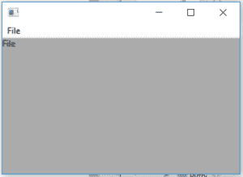

# wx python–wx 中的 getmenu()函数。MenuItem

> 哎哎哎:# t0]https://www . geeksforgeeks . org/wx python-getmenu-in-wx-menu item/函数

在本文中，我们将学习与 wx 相关联的 GetMenu()函数。wxPython 的 MenuItem 类。函数的作用是:返回该菜单项所在的菜单，如果没有附加该菜单项，则返回无。
GetMenu()函数不需要参数。

> **语法:**
> 
> ```py
> wx.MenuItem.GetMenu(self)
> 
> ```
> 
> **参数:**
> 
> ```py
> No parameters are required in GetMenu() function.
> 
> ```
> 
> **返回类型:**
> 
> ```py
> wx.Menu
> 
> ```

**代码示例 1:**

```py
import wx

class Example(wx.Frame):

    def __init__(self, *args, **kwargs):
        super(Example, self).__init__(*args, **kwargs)

        self.InitUI()

    def InitUI(self):
        self.locale = wx.Locale(wx.LANGUAGE_ENGLISH)

        self.menubar = wx.MenuBar()
        self.fileMenu = wx.Menu()
        self.item = wx.MenuItem(self.fileMenu, 1, '&Check\tCtrl + c', helpString ="Check Help")
        self.item.SetMarginWidth(12)
        self.st = wx.StaticText(self, label ="", pos =(20, 20), style = wx.ALIGN_LEFT)
        self.fileMenu.Append(self.item)
        self.menubar.Append(self.fileMenu, '&File')
        self.SetMenuBar(self.menubar)
        # menu object
        menu = self.item.GetMenu()
        # print title of menu
        print(menu.Title)
        self.st.SetLabel(menu.Title)
        self.SetSize((350, 250))
        self.SetTitle('')
        self.Centre()

def main():
    app = wx.App()
    ex = Example(None)
    ex.Show()
    app.MainLoop()

if __name__ == '__main__':
    main()
```

**输出:**

```py
&File

```

**输出窗口:**
