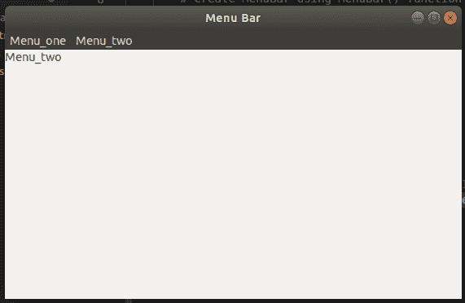

# wx Tyson–wx 中的 GetMenuLabelText()函数。菜单栏

> 原文:[https://www . geesforgeks . org/wxpython-getmenulabeltext-function-in-wx-menubar/](https://www.geeksforgeeks.org/wxpython-getmenulabeltext-function-in-wx-menubar/)

`GetMenuTextLabel()`是`GetMenuLabel()`功能的替代。就像`GetMenuLabel()`功能一样`GeteMenuTextLabel()`功能用于返回菜单栏中出现的菜单标签。`GetMenuTextLabel()`仅在菜单栏中占据菜单位置。

> **语法:**
> 
> ```py
> wx.MenuBar.GetMenuLabelText(self, menuindex)
> 
> ```
> 
> **参数:**
> 
> | 参数 | 输入类型 | 描述 |
> | --- | --- | --- |
> | 刷卡机 | （同 Internationalorganizations）国际组织 | 菜单栏上菜单的位置，从零开始。 |
> 
> **返回:**菜单标签，如果没有找到菜单，则返回空字符串。

**代码示例:**

```py
import wx

class Example(wx.Frame):

    def __init__(self, *args, **kw):
        super(Example, self).__init__(*args, **kw)

        # create MenuBar using MenuBar() function
        menubar = wx.MenuBar()

        # add menu to MenuBar
        fm1 = wx.Menu()
        fileitem = fm1.Append(20, "one")
        fm2 = wx.Menu()
        fileitem2 = fm2.Append(21, "two")
        menubar.Append(fm1, '&Menu_one')
        menubar.Append(fm2, '&Menu_two')

        self.SetMenuBar(menubar)
        self.SetSize((300, 200))
        self.SetTitle('Menu Bar')

        # STATIC TEXT WITH LABEL OF MENU AT POSITIO 1
        st1 = wx.StaticText(self, label = menubar.GetMenuLabelText(1), 
                                                style = wx.ALIGN_LEFT)

def main():
    app = wx.App()
    ex = Example(None)
    ex.Show()
    app.MainLoop()

if __name__ == '__main__':
    main()
```

**窗口:**
