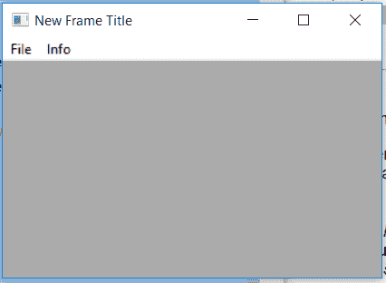

# wx 中的 wxPython–GetMenus()函数。菜单栏

> 原文:[https://www . geesforgeks . org/wxpython-get menus-function-in-wx-menu bar/](https://www.geeksforgeeks.org/wxpython-getmenus-function-in-wx-menubar/)

在本文中，我们将学习与 wx 相关的 GetMenus()函数。wxPython 的菜单栏类。函数只是返回菜单栏中菜单的(菜单、标签)项目列表。
getMenus()函数中不需要参数。

> **语法:** wx。菜单栏获取菜单(自身)
> 
> **参数:**GetMenus()函数中不需要参数。

**代码示例:**

```py
import wx

class Example(wx.Frame):

    def __init__(self, *args, **kwargs):
        super(Example, self).__init__(*args, **kwargs)

        self.InitUI()

    def InitUI(self):

        self.locale = wx.Locale(wx.LANGUAGE_ENGLISH)
        self.menubar = wx.MenuBar()
        self.fileMenu = wx.Menu()
        self.fileMenu2 = wx.Menu()
        self.item = wx.MenuItem(self.fileMenu, 1, '&Check', 
                                 helpString ="Check Help")
        self.item.SetBitmap(wx.Bitmap('right.png'))
        self.fileMenu.Append(self.item)
        self.menubar.Append(self.fileMenu, '&File')
        self.menubar.Append(self.fileMenu2, '&Info')
        self.SetMenuBar(self.menubar)

        # PRINT (MENU, LABEL) LIST ITEMS IN MENUBAR
        print(self.menubar.GetMenus())
        self.SetSize((350, 250))
        self.SetTitle('New Frame Title')
        self.Centre()

def main():
    app = wx.App()
    ex = Example(None)
    ex.Show()
    app.MainLoop()

if __name__ == '__main__':
    main()
```

**控制台输出:**

```py
[(<wx._core.Menu object at 0x00000075049250D0>, '&File'), (<wx._core.Menu object at 0x0000007504925160>, '&Info')]

```

**输出窗口:**
