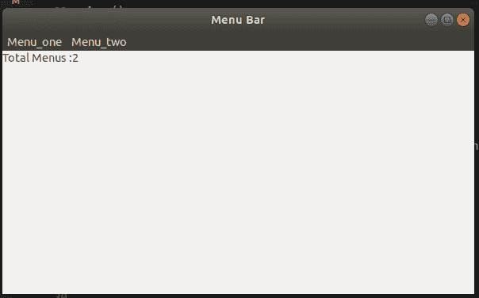

# wx xpython–wx 中的 GetMeuCount()函数。菜单栏

> 原文:[https://www . geesforgeks . org/wxpython-getmeucount-function-in-wx-menu bar/](https://www.geeksforgeeks.org/wxpython-getmeucount-function-in-wx-menubar/)

`GetMenuCount()`函数是 wx 中存在的另一个函数。wxPython 的菜单栏类。`GetMenuCount()`函数返回菜单栏中出现的菜单总数。不需要争论。

> **语法:** wx。菜单栏。获取菜单项(自身)
> 
> **参数:**GetMenuItem()中没有参数
> 
> **返回:**返回此菜单栏中的菜单数量。

**代码:**

将 statictext 的标签设置为菜单项的总数。

```py
import wx

class Example(wx.Frame):

    def __init__(self, *args, **kw):
        super(Example, self).__init__(*args, **kw)

        # create MenuBar using MenuBar() function
        menubar = wx.MenuBar()

        # add menu to MenuBar
        fm1 = wx.Menu()
        fileitem = fm1.Append(20, "one")

        fm2 = wx.Menu()
        fileitem2 = fm2.Append(21, "two")
        menubar.Append(fm1, '&Menu_one')
        menubar.Append(fm2, '&Menu_two')
        self.SetMenuBar(menubar)
        self.SetSize((300, 200))
        self.SetTitle('Menu Bar')
        st1 = wx.StaticText(self, label ="Total Menus :" + str(menubar.GetMenuCount()), 
                                                                 style = wx.ALIGN_LEFT)

def main():
    app = wx.App()
    ex = Example(None)
    ex.Show()
    app.MainLoop()

if __name__ == '__main__':
    main()
```

**输出:**
