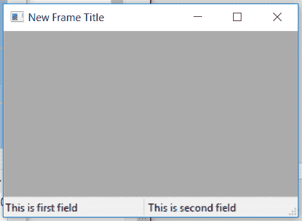

# wx Tyson–wx 中的 GetStatusStyle()函数。状态栏

> 原文:[https://www . geesforgeks . org/wxpython-getstatusstyle-function-in-wx-status bar/](https://www.geeksforgeeks.org/wxpython-getstatusstyle-function-in-wx-statusbar/)

在本文中，我们将了解与 wx 相关联的 GetStatusStyle()函数。wxPython 的 StatusBar 类。GetStatusStyle()用于简单地返回第 n 个字段的样式。它只接受状态字段的位置作为参数。

> **语法:**wx . status bar . get status style(self，n)
> 
> **参数:**
> 
> | 参数 | 输入类型 | 描述 |
> | --- | --- | --- |
> | n | 状态栏中状态字段的位置从 0 开始。 | 框架与菜单栏匹配 |
> 
> **返回类型:** int

**代码示例:**

```py
import wx

class Example(wx.Frame):

    def __init__(self, *args, **kwargs):
        super(Example, self).__init__(*args, **kwargs)

        self.InitUI()

    def InitUI(self):

        self.locale = wx.Locale(wx.LANGUAGE_ENGLISH)
        self.statusbar = wx.StatusBar()
        self.statusbar.Create(self, id = 1, style = wx.STB_DEFAULT_STYLE, 
                                                     name = "Status Bar")

        self.SetStatusBar(self.statusbar)
        self.SetSize((350, 250))
        self.statusbar.SetFieldsCount(2)
        self.statusbar.SetStatusWidths([150, 150])
        self.statusbar.SetStatusText("This is first field", 0)
        self.statusbar.SetStatusText("This is second field", 1)
        self.statusbar.SetStatusStyles(styles =[wx.SB_RAISED, wx.SB_SUNKEN])

        # PRINT STATUS TYLES IDENTIFIERS OF TWO FIELDS
        print(self.statusbar.GetStatusStyle(0))
        print(self.statusbar.GetStatusStyle(1))

        self.SetTitle('New Frame Title')
        self.Centre()

def main():
    app = wx.App()
    ex = Example(None)
    ex.Show()
    app.MainLoop()

if __name__ == '__main__':
    main()
```

**控制台输出:**

```py
2
3

```

**输出窗口:**
