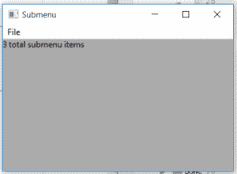

# wx python–getsubmenu()wx 中的函数。MenuItem

> 原文:[https://www . geeksforgeeks . org/wxpython-get subscribe-function-in-wx-menuitem/](https://www.geeksforgeeks.org/wxpython-getsubmenu-function-in-wx-menuitem/)

在本文中，我们将学习与类 wx 相关联的 GetSubscription()函数。wxPython 中的 MenuItem。函数的作用是:返回与菜单项相关联的子菜单，如果没有子菜单，则返回无。
getsubneu()函数中不需要参数。

> **语法:**
> 
> ```py
> wx.MenuItem.GetSubMenu(self)
> 
> ```
> 
> **参数:**
> 
> ```py
> No parameters are needed in GetSubMneu() function.
> 
> ```
> 
> **返回类型:**
> 
> ```py
> wx.Menu
> 
> ```

**代码示例:**

```py
import wx

class Example(wx.Frame):

    def __init__(self, *args, **kwargs):
        super(Example, self).__init__(*args, **kwargs)

        self.InitUI()

    def InitUI(self):

        menubar = wx.MenuBar()

        fileMenu = wx.Menu()

        sm = wx.Menu()
        sm.Append(wx.ID_ANY, 'Submenu item 1')
        sm.Append(wx.ID_ANY, 'Submenu item 2')
        sm.Append(wx.ID_ANY, 'Submenu item 3')
        self.st = wx.StaticText(self, label ="", pos =(20, 20), style = wx.ALIGN_LEFT)
        item = wx.MenuItem(fileMenu, 1, '&Check\tCtrl + c', helpString ="Check Help")
        item.SetSubMenu(sm)
        fileMenu.AppendMenu(wx.ID_ANY, 'I&mport', sm)
        # get submenu
        s = item.GetSubMenu()
        # get total sub menu item
        n = s.MenuItemCount
        # print total sub menu item
        print(n)
        self.st.SetLabel(str(n)+" total submenu items")
        menubar.Append(fileMenu, '&File')
        self.SetMenuBar(menubar)

        self.SetSize((350, 250))
        self.SetTitle('Submenu')
        self.Centre()

def main():

    app = wx.App()
    ex = Example(None)
    ex.Show()
    app.MainLoop()

if __name__ == '__main__':
    main()
```

**输出:**

```py
3

```

**输出:**
