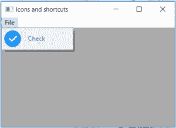

# wx 中的 wxPython–gettextcolor()函数。菜单项

> 原文:[https://www . geeksforgeeks . org/wxpython-gettextcolor-function-in-wx-menuitem/](https://www.geeksforgeeks.org/wxpython-gettextcolour-function-in-wx-menuitem/)

在本文中，我们将学习与 wx 相关联的 GetTextColour()函数。wxPython 的 MenuItem 类。GetTextColour()函数用于简单地返回与菜单项相关联的文本颜色。
gettextcolor()函数中不需要参数。

> **语法:**
> 
> ```py
> wx.MenuItem.GetTextColour(self)
> ```
> 
> **参数:**
> 
> ```py
> No parameters are taken by GetTextColour() function.
> ```
> 
> **返回类型:**
> 
> ```py
> wx.Colour
> ```

**代码示例:**

## 蟒蛇 3

```py
import wx

class Example(wx.Frame):

    def __init__(self, *args, **kwargs):
        super(Example, self).__init__(*args, **kwargs)

        self.InitUI()

    def InitUI(self):
        self.locale = wx.Locale(wx.LANGUAGE_ENGLISH)

        self.menubar = wx.MenuBar()
        self.fileMenu = wx.Menu()
        self.item = wx.MenuItem(self.fileMenu, 1, '&Check', helpString ="Check Help")
        self.item.SetBitmap(wx.Bitmap('right.png'))
        self.item.SetTextColour((79, 81, 230, 255))
        self.st = wx.StaticText(self, label ="", pos =(200, 200))
        self.fileMenu.Append(self.item)
        self.menubar.Append(self.fileMenu, '&File')
        self.SetMenuBar(self.menubar)
        # label of menu item
        clr = self.item.GetTextColour()
        # print label of menuitem
        print(clr)
        self.SetSize((350, 250))
        self.SetTitle('Icons and shortcuts')
        self.Centre()

def main():
    app = wx.App()
    ex = Example(None)
    ex.Show()
    app.MainLoop()

if __name__ == '__main__':
    main()
```

**输出:**

```py
(79, 81, 230, 255)
```

**输出窗口:**

