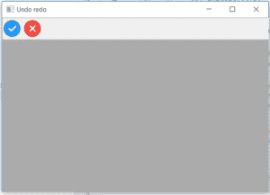
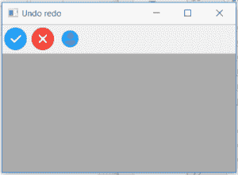

# wx 中的 wxPython | GetToolsCount()函数。工具栏

> 原文:[https://www . geesforgeks . org/wxpython-gettoolscount-function-in-wx-toolbar/](https://www.geeksforgeeks.org/wxpython-gettoolscount-function-in-wx-toolbar/)

在本文中，我们将学习与类 wx 相关联的 GetToolsCount()函数。wxPython 中的工具栏。GetToolsCount()函数只是返回工具栏中工具的数量。GetToolsCount()函数不接受任何参数。

> **语法:**
> 
> ```py
> wx.ToolBar.GetToolsCount(self)
> 
> ```
> 
> **参数:**
> 
> ```py
> No parameters are required in GetToolsCount() function.
> 
> ```
> 
> **返回类型:**
> 
> ```py
> int
> 
> ```

**代码示例 1:**

```py
import wx

class Example(wx.Frame):

    def __init__(self, *args, **kwargs):
        super(Example, self).__init__(*args, **kwargs)

        self.InitUI()

    def InitUI(self):

        self.count = 5
        self.locale = wx.Locale(wx.LANGUAGE_ENGLISH)
        self.toolbar = self.CreateToolBar()
        tundo = self.toolbar.AddTool(wx.ID_UNDO, '', wx.Bitmap('right.png'))
        tredo = self.toolbar.AddTool(wx.ID_REDO, '', wx.Bitmap('wrong.png'))

        self.toolbar.Realize()
        self.Bind(wx.EVT_TOOL, self.OnUndo, tundo)
        self.Bind(wx.EVT_TOOL, self.OnRedo, tredo)

        print(self.ToolBar.GetToolsCount())
        self.SetSize((350, 250))
        self.SetTitle('Undo redo')
        self.Centre()

    def OnUndo(self, e):
        if self.count > 1 and self.count <= 5:
            self.count = self.count - 1

        if self.count == 1:
            self.toolbar.EnableTool(wx.ID_UNDO, False)

        if self.count == 4:
            self.toolbar.EnableTool(wx.ID_REDO, True)

    def OnRedo(self, e):
        if self.count < 5 and self.count >= 1:
            self.count = self.count + 1

        if self.count == 5:
            self.toolbar.EnableTool(wx.ID_REDO, False)

        if self.count == 2:
            self.toolbar.EnableTool(wx.ID_UNDO, True)

    def OnQuit(self, e):
        self.Close()

def main():

    app = wx.App()
    ex = Example(None)
    ex.Show()
    app.MainLoop()

if __name__ == '__main__':
    main()
```

**输出:**
*窗口:*

*打印输出:*

```py
2

```

**代码示例 2:**

```py
import wx

class Example(wx.Frame):

    def __init__(self, *args, **kwargs):
        super(Example, self).__init__(*args, **kwargs)

        self.InitUI()

    def InitUI(self):

        self.count = 5
        self.locale = wx.Locale(wx.LANGUAGE_ENGLISH)
        self.toolbar = self.CreateToolBar()
        tundo = self.toolbar.AddTool(wx.ID_UNDO, '', wx.Bitmap('right.png'))
        tredo = self.toolbar.AddTool(wx.ID_REDO, '', wx.Bitmap('wrong.png'))
        tperson = self.toolbar.AddTool(wx.ID_REDO, '', wx.Bitmap('user.png'))

        self.toolbar.Realize()
        self.Bind(wx.EVT_TOOL, self.OnUndo, tundo)
        self.Bind(wx.EVT_TOOL, self.OnRedo, tredo)

        print(self.ToolBar.GetToolsCount())
        self.SetSize((350, 250))
        self.SetTitle('Undo redo')
        self.Centre()

    def OnUndo(self, e):
        if self.count > 1 and self.count <= 5:
            self.count = self.count - 1

        if self.count == 1:
            self.toolbar.EnableTool(wx.ID_UNDO, False)

        if self.count == 4:
            self.toolbar.EnableTool(wx.ID_REDO, True)

    def OnRedo(self, e):
        if self.count < 5 and self.count >= 1:
            self.count = self.count + 1

        if self.count == 5:
            self.toolbar.EnableTool(wx.ID_REDO, False)

        if self.count == 2:
            self.toolbar.EnableTool(wx.ID_UNDO, True)

    def OnQuit(self, e):
        self.Close()

def main():

    app = wx.App()
    ex = Example(None)
    ex.Show()
    app.MainLoop()

if __name__ == '__main__':
    main()
```

**输出:**
*窗口:*

*打印输出:*

```py
3

```