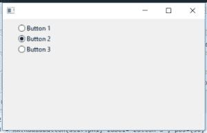

# wx 中的 wxPython–GetValue()方法。单选按钮

> 原文:[https://www . geesforgeks . org/wxpython-getvalue-method-in-wx-radio button/](https://www.geeksforgeeks.org/wxpython-getvalue-method-in-wx-radiobutton/)

Python 提供了[**【wxpython】**](https://www.geeksforgeeks.org/python-wxpython-module-introduction/)****包**，允许我们创建高功能的图形用户界面。它是 python 的跨平台 GUI 工具包，凤凰版凤凰是改进的下一代 wxPython，它主要关注速度、可维护性和可扩展性。**

**在本文中，我们将了解 ***GetValue()方法*** 关联 ***wx。wxPython 的*** 类单选按钮。 ***GetValue()*** 功能用于勾选单选按钮则返回 True，否则返回 False。
GetValue()函数不需要参数。** 

> ****语法:** wx。获取值(自身)**
> 
>  ****参数:** GetValue()函数不需要参数。
> 
> **返回:**如果单选按钮被选中则返回真，否则返回假**

****例:**** 

## **蟒蛇 3**

```
# importing wx library
import wx

APP_EXIT = 1

# create a Example class
class Example(wx.Frame):

    # constructor
    def __init__(self, *args, **kwargs):
        super(Example, self).__init__(*args, **kwargs)

        # method calling
        self.InitUI()

    # method for user interface creation
    def InitUI(self):

        # create a parent panel for radio buttons
        self.pnl = wx.Panel(self)

        # create a radio buttons in frame
        self.rb1 = wx.RadioButton(self.pnl,
                                  label = 'Button 1',
                                  pos = (30, 10))
        self.rb2 = wx.RadioButton(self.pnl,
                                  label = 'Button 2',
                                  pos = (30, 30))
        self.rb3 = wx.RadioButton(self.pnl,
                                  label = 'Button 3',
                                  pos = (30, 50))

        # change value of second button to True
        self.rb2.SetValue(True)

        # print values of radio buttons True
        # if checked, False otherwise
        print(self.rb1.GetValue())
        print(self.rb2.GetValue())
        print(self.rb3.GetValue())

# main function
def main():

      # create a App object
    app = wx.App()
    # create a Example object
    ex = Example(None)

    ex.Show()

    # running a app
    app.MainLoop()

# Driver code
if __name__ == '__main__':

  # main function call
  main()
```

****输出:**** 

```
False
True
False
```

**

单选按钮**