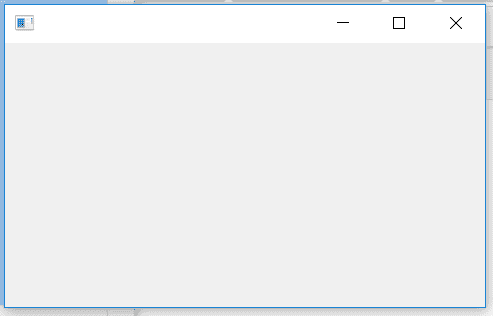

# wxPython–隐藏单选按钮

> 原文:[https://www.geeksforgeeks.org/wxpython-hide-radio-button/](https://www.geeksforgeeks.org/wxpython-hide-radio-button/)

在本文中，我们将学习如何隐藏框架上的单选按钮。我们可以使用 hide()函数隐藏单选按钮。Hide()函数不接受任何参数，并从框架中隐藏单选按钮窗口。Hide()与 Drop()不同，它只是隐藏单选按钮，并且可以在 Drop()删除单选按钮窗口时再次显示。

> **语法:** wx。单选按钮。隐藏(自我)
> 
> **参数:** Hide()函数不需要参数。
> 
> **返回类型:** bool

**代码示例:**

```
import wx

APP_EXIT = 1

class Example(wx.Frame):

    def __init__(self, *args, **kwargs):
        super(Example, self).__init__(*args, **kwargs)

        self.InitUI()

    def InitUI(self):
        self.pnl = wx.Panel(self)

        # create radio button at position (30, 10)
        self.rb1 = wx.RadioButton(self.pnl, label ='Btn1', 
                                pos =(30, 10), size =(100, 20))

        # hide radio button
        self.rb1.Hide()

def main():
    app = wx.App()
    ex = Example(None)
    ex.Show()
    app.MainLoop()

if __name__ == '__main__':
    main()
```

**输出窗口:**
