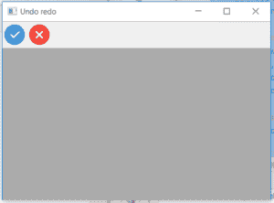
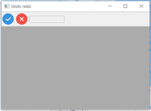
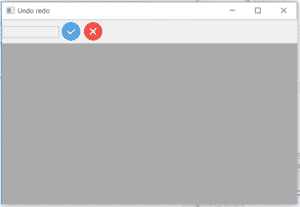

# wx 中的 wxPython | InsertControl()函数。工具栏

> 原文:[https://www . geesforgeks . org/wxpython-insert control-function-in-wx-toolbar/](https://www.geeksforgeeks.org/wxpython-insertcontrol-function-in-wx-toolbar/)

在本文中，我们将学习与 wx 相关联的 InsertControl()函数。wxPython 的工具栏类。InsertControl()将控件插入工具栏中的给定位置。请注意，您必须调用“实现”才能进行更改。

> **语法:**
> 
> ```
> wx.ToolBar.InsertControl(self, pos, control, label="")
> 
> ```
> 
> **参数:**
> 
> | 参数 | 输入类型 | 描述 |
> | --- | --- | --- |
> | 刷卡机 | （同 Internationalorganizations）国际组织 | 从 0 开始插入控件的位置。 |
> | 控制 | wx。控制 | 要插入的控件。 |
> | 标签 | 线 | 要在控件上显示的标签。 |
> 
> **返回类型:**
> 
> ```
> wx.ToolBarToolBase
> 
> ```

**代码示例 1:** 单击工具栏上的勾号工具时，会插入一个控件。

```
import wx

class Example(wx.Frame):

    def __init__(self, *args, **kwargs):
        super(Example, self).__init__(*args, **kwargs)

        self.InitUI()

    def InitUI(self):
        self.locale = wx.Locale(wx.LANGUAGE_ENGLISH)
        self.toolbar = self.CreateToolBar()
        tundo = self.toolbar.AddTool(1, '', wx.Bitmap('right.png'))
        tredo = self.toolbar.AddTool(2, '', wx.Bitmap('wrong.png'))

        self.toolbar.Realize()
        self.Bind(wx.EVT_TOOL, self.OnOne, tundo)

        self.SetSize((350, 250))
        self.SetTitle('Undo redo')
        self.Centre()

    def OnOne(self, e):
        ctrl = wx.Control(self.toolbar, id = 1, size =(100, -1),
        style = 0,  name ="control")
        # insert control in toolbar at position 2
        self.toolbar.InsertControl(pos = 2, control = ctrl, label ="Control")
        self.toolbar.Realize()

    def OnQuit(self, e):
        self.Close()

def main():

    app = wx.App()
    ex = Example(None)
    ex.Show()
    app.MainLoop()

if __name__ == '__main__':
    main()
```

**输出:**
*点击前打勾:*


*点击打勾后:*


**代码示例 2:** 单击工具栏上的勾号工具时，会插入一个控件。

```
import wx

class Example(wx.Frame):

    def __init__(self, *args, **kwargs):
        super(Example, self).__init__(*args, **kwargs)

        self.InitUI()

    def InitUI(self):
        self.locale = wx.Locale(wx.LANGUAGE_ENGLISH)
        self.toolbar = self.CreateToolBar()
        tundo = self.toolbar.AddTool(1, '', wx.Bitmap('right.png'))
        tredo = self.toolbar.AddTool(2, '', wx.Bitmap('wrong.png'))

        self.toolbar.Realize()
        self.Bind(wx.EVT_TOOL, self.OnOne, tundo)

        self.SetSize((350, 250))
        self.SetTitle('Undo redo')
        self.Centre()

    def OnOne(self, e):
        ctrl = wx.Control(self.toolbar, id = 1, size =(100, -1),
        style = 0,  name ="control")
        # insert control in toolbar at position 2
        self.toolbar.InsertControl(pos = 0, control = ctrl, label ="Control")
        self.toolbar.Realize()

    def OnQuit(self, e):
        self.Close()

def main():

    app = wx.App()
    ex = Example(None)
    ex.Show()
    app.MainLoop()

if __name__ == '__main__':
    main()
```

**输出:**
*点击前打勾:*


*点击打勾后:*
