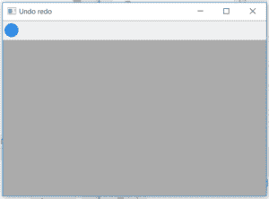
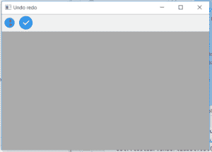

# wx 中的 wxPython | InsertLabelTool()函数。工具栏

> 原文:[https://www . geesforgeks . org/wxpython-insertlabeltool-function-in-wx-toolbar/](https://www.geeksforgeeks.org/wxpython-insertlabeltool-function-in-wx-toolbar/)

在本文中，我们将学习与类 wx 相关联的 InsertLabelTool()函数。wxPython 中的工具栏。InsertLabelTool()是一种在工具栏中插入工具的旧样式方法。InsertLabelTool()将工具的不同属性作为插入工具的参数。

> **语法:**
> 
> ```
> wx.ToolBar.InsertLabelTool(self, pos, id, label, bitmap, bmpDisabled=wx.NullBitmap, kind=wx.ITEM_NORMAL, shortHelp="", longHelp="", clientData=None)
> 
> ```
> 
> **参数:**
> 
> | 参数 | 输入类型 | 描述 |
> | --- | --- | --- |
> | 刷卡机 | （同 Internationalorganizations）国际组织 | 从 0 开始添加工具的位置。 |
> | 身份证明（identification） | （同 Internationalorganizations）国际组织 | 一个整数，通过它可以在后续操作中识别工具。 |
> | 标签 | 线 | 工具要显示的字符串。 |
> | 位图 | wx .位图 | 主要工具位图。 |
> | bmpDisabled | wx .位图 | 工具禁用时使用的位图。 |
> | 种类 | （同 Internationalorganizations）国际组织 | 有点像工具栏。 |
> | 简短的帮助 | 线 | 该字符串用于工具提示。 |
> | longHelp | 线 | 与工具关联的详细字符串。 |
> | clientdate | PyUserData | 一个指向客户端数据的可选指针，稍后可以使用 GetToolClientData 检索该指针。 |
> 
> **返回类型:**
> 
> ```
> wx.ToolBarToolBase
> 
> ```

**代码示例 1:**

```
import wx

class Example(wx.Frame):

    def __init__(self, *args, **kwargs):
        super(Example, self).__init__(*args, **kwargs)

        self.InitUI()

    def InitUI(self):
        self.locale = wx.Locale(wx.LANGUAGE_ENGLISH)
        self.toolbar = self.CreateToolBar()
        td = self.toolbar.AddTool(1, '', wx.Bitmap('user.png'))

        self.toolbar.Realize()
        self.Bind(wx.EVT_TOOL, self.OnOne, td)

        self.SetSize((350, 250))
        self.SetTitle('Undo redo')
        self.Centre()

    def OnOne(self, e):
        # insert tool at position 1
        self.toolbar.InsertLabelTool( pos = 1, id = 3, label ='new tool1', bitmap = wx.Bitmap('right.png'), kind = wx.ITEM_NORMAL, shortHelp ="nono")
        self.toolbar.Realize()

    def OnQuit(self, e):
        self.Close()

def main():

    app = wx.App()
    ex = Example(None)
    ex.Show()
    app.MainLoop()

if __name__ == '__main__':
    main()
```

**输出:**
*之前点击*


*点击配置文件工具后:*
