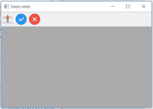
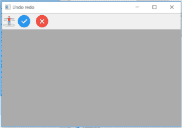
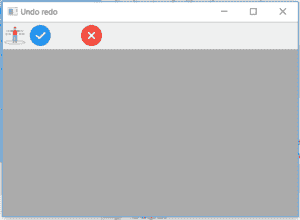

# wx 中的 wxPython | InsertSeparator()函数。工具栏

> 原文:[https://www . geesforgeks . org/wxpython-insert separator-function-in-wx-toolbar/](https://www.geeksforgeeks.org/wxpython-insertseparator-function-in-wx-toolbar/)

在本文中，我们将了解如何了解与 wx 相关联的 InsertSeparator()函数。wxPython 的工具栏类。InsertSeparator()函数只需将分隔符插入工具栏的给定位置。请注意，您必须调用“实现”才能进行更改。它只把位置作为参数。

> **语法:**
> 
> ```
> wx.ToolBar.InsertSeparator(self, pos)
> 
> ```
> 
> **参数:**
> 
> | 参数 | 输入类型 | 描述 |
> | --- | --- | --- |
> | 刷卡机 | （同 Internationalorganizations）国际组织 | 从 0 开始插入分隔的位置。 |
> 
> **返回类型:**
> 
> ```
> wx.ToolBarToolBase
> 
> ```

**代码示例 1:**

```
import wx

class Example(wx.Frame):

    def __init__(self, *args, **kwargs):
        super(Example, self).__init__(*args, **kwargs)

        self.InitUI()

    def InitUI(self):
        self.locale = wx.Locale(wx.LANGUAGE_ENGLISH)
        self.toolbar = self.CreateToolBar()
        td = self.toolbar.AddTool(1, '', wx.Bitmap('sep.png'))
        te = self.toolbar.AddTool(2, '', wx.Bitmap('right.png'))
        tf = self.toolbar.AddTool(3, '', wx.Bitmap('wrong.png'))

        self.toolbar.Realize()
        self.Bind(wx.EVT_TOOL, self.OnOne, td)

        self.SetSize((350, 250))
        self.SetTitle('Undo redo')
        self.Centre()

    def OnOne(self, e):
        # insert separator b / w tick and cross tool
        self.toolbar.InsertSeparator( pos = 2)
        self.toolbar.Realize()

    def OnQuit(self, e):
        self.Close()

def main():

    app = wx.App()
    ex = Example(None)
    ex.Show()
    app.MainLoop()

if __name__ == '__main__':
    main()
```

**输出:**
*点击单独图标前:*


*点击单独图标后:*


**代码示例 2:**

```
import wx

class Example(wx.Frame):

    def __init__(self, *args, **kwargs):
        super(Example, self).__init__(*args, **kwargs)

        self.InitUI()

    def InitUI(self):
        self.locale = wx.Locale(wx.LANGUAGE_ENGLISH)
        self.toolbar = self.CreateToolBar()
        td = self.toolbar.AddTool(1, '', wx.Bitmap('sep.png'))
        te = self.toolbar.AddTool(2, '', wx.Bitmap('right.png'))
        tf = self.toolbar.AddTool(3, '', wx.Bitmap('wrong.png'))

        self.toolbar.Realize()
        self.Bind(wx.EVT_TOOL, self.OnOne, td)

        self.SetSize((350, 250))
        self.SetTitle('Undo redo')
        self.Centre()

    def OnOne(self, e):
        for i in range(5):
            # insert 5 separator tick and cross tool
            self.toolbar.InsertSeparator( pos = 2)
            self.toolbar.Realize()

    def OnQuit(self, e):
        self.Close()

def main():

    app = wx.App()
    ex = Example(None)
    ex.Show()
    app.MainLoop()

if __name__ == '__main__':
    main()
```

**输出:**
*点击单独图标前:*


*点击单独图标后:*
