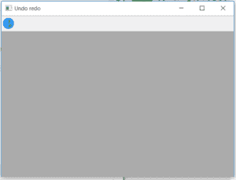
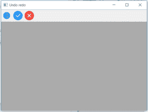

# python 中的 wxPython | InsertSimpleTool()函数

> 原文:[https://www . geesforgeks . org/wxpython-insertsimpletool-function-in-python/](https://www.geeksforgeeks.org/wxpython-insertsimpletool-function-in-python/)

在本文中，我们将学习与 wx 相关联的 InsertSimpleTool()函数。wxPython 的工具栏类。InsertSimpleTool()函数是在工具栏中插入工具的另一种老式方法。InsertSimpleTool()函数将具有指定属性的工具插入到工具栏的给定位置。

> **语法:**
> 
> ```
> wx.ToolBar.InsertSimplTool(self, pos, toolId, bitmap, shortHelpString="", longHelpString="", isToggle=0)
> ```
> 
> **参数:**
> 
> <figure class="table">
> 
> | 参数 | 输入类型 | 描述 |
> | --- | --- | --- |
> | 刷卡机 | （同 Internationalorganizations）国际组织 | 要添加的工具的位置从 0 开始。 |
> | 椅子 | （同 Internationalorganizations）国际组织 | 一个整数，通过它可以在后续操作中识别工具。 |
> | 位图 | wx .位图 | 主要工具位图。 |
> | shortHelpString | 线 | 该字符串用于工具提示。 |
> | longHelpString | 线 | 与工具关联的详细字符串。 |
> | istoggled | （同 Internationalorganizations）国际组织 | 0 表示正常，1 表示切换按钮。 |
> 
> </figure>
> 
> **返回类型:**
> 
> ```
> wx.ToolBarToolBase
> ```

**代码示例 1:**

## 蟒蛇 3

```
import wx

class Example(wx.Frame):

    def __init__(self, *args, **kwargs):
        super(Example, self).__init__(*args, **kwargs)
        self.InitUI()

    def InitUI(self):
        self.locale = wx.Locale(wx.LANGUAGE_ENGLISH)
        self.toolbar = self.CreateToolBar()
        td = self.toolbar.AddTool(1, '', wx.Bitmap('user.png'))

        self.toolbar.Realize()
        self.Bind(wx.EVT_TOOL, self.OnOne, td)

        self.SetSize((350, 250))
        self.SetTitle('Undo redo')
        self.Centre()

    def OnOne(self, e):
        # insert tool at position 1
        self.toolbar.InsertSimpleTool(pos = 1, toolId = 2, bitmap = wx.Bitmap('right.png'), shortHelpString ="new tool one", isToggle = 0)
        # insert tool at position 2
        self.toolbar.InsertSimpleTool(pos = 2, toolId = 3, bitmap = wx.Bitmap('wrong.png'), shortHelpString ="new tool two", isToggle = 0)
        self.toolbar.Realize()

    def OnQuit(self, e):
        self.Close()

def main():

    app = wx.App()
    ex = Example(None)
    ex.Show()
    app.MainLoop()

if __name__ == '__main__':
    main()
```

**输出:**
*点击简介图标前:*



*点击配置文件图标后:*

