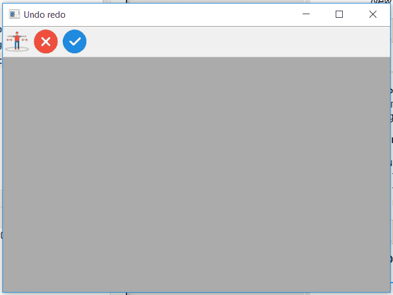
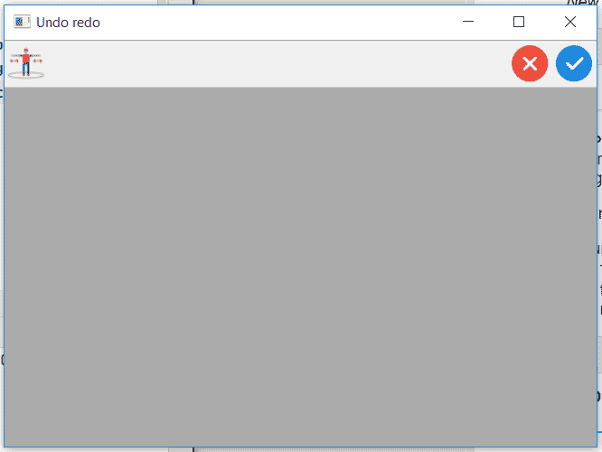
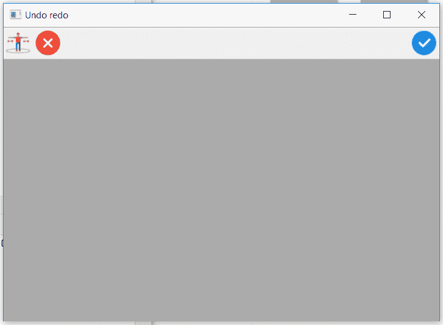

# wxPython–在 wx 中插入 InsertStretchableSpace()函数。工具栏

> 原文:[https://www . geesforgeks . org/wxpython-insertstractablespace-function-in-wx-toolbar/](https://www.geeksforgeeks.org/wxpython-insertstretchablespace-function-in-wx-toolbar/)

在本文中，我们将学习与 wx 相关联的 InsertStretchableSpace()函数。wxPython 的工具栏类。InsertStretchableSpace()在给定位置插入可拉伸的空间。请注意，更改将在调用 implement()后发生。它只接受 pos 作为参数。

> **语法:**
> 
> ```
> wx.ToolBar.InsertStretchableSpace(self, pos)
> 
> ```
> 
> **参数:**
> 
> | 参数 | 输入类型 | 描述 |
> | --- | --- | --- |
> | 刷卡机 | （同 Internationalorganizations）国际组织 | 要添加的工具的位置从 0 开始。 |
> 
> **返回类型:**
> 
> ```
> wx.ToolBarToolBase
> 
> ```

**Code Example 1:**

```
import wx

class Example(wx.Frame):

    def __init__(self, *args, **kwargs):
        super(Example, self).__init__(*args, **kwargs)
        self.InitUI()

    def InitUI(self):
        self.locale = wx.Locale(wx.LANGUAGE_ENGLISH)
        self.toolbar = self.CreateToolBar()
        td = self.toolbar.AddTool(1, '', wx.Bitmap('sep.png'))
        te = self.toolbar.AddTool(2, '', wx.Bitmap('wrong.png'))
        tf = self.toolbar.AddTool(3, '', wx.Bitmap('right.png'))

        self.toolbar.Realize()
        self.Bind(wx.EVT_TOOL, self.OnOne, td)

        self.SetSize((350, 250))
        self.SetTitle('Undo redo')
        self.Centre()

    def OnOne(self, e):
        # insert stretchable space b / w separate 
        # and tick tool at position 1
        self.toolbar.InsertStretchableSpace(pos = 1)
        self.toolbar.Realize()

    def OnQuit(self, e):
        self.Close()

def main():

    app = wx.App()
    ex = Example(None)
    ex.Show()
    app.MainLoop()

if __name__ == '__main__':
    main()
```

**输出:**
*点击前分开工具:*


*点击后分开工具:*


**代码示例 1:**

```
import wx

class Example(wx.Frame):

    def __init__(self, *args, **kwargs):
        super(Example, self).__init__(*args, **kwargs)
        self.InitUI()

    def InitUI(self):
        self.locale = wx.Locale(wx.LANGUAGE_ENGLISH)
        self.toolbar = self.CreateToolBar()
        td = self.toolbar.AddTool(1, '', wx.Bitmap('sep.png'))
        te = self.toolbar.AddTool(2, '', wx.Bitmap('wrong.png'))
        tf = self.toolbar.AddTool(3, '', wx.Bitmap('right.png'))

        self.toolbar.Realize()
        self.Bind(wx.EVT_TOOL, self.OnOne, td)

        self.SetSize((350, 250))
        self.SetTitle('Undo redo')
        self.Centre()

    def OnOne(self, e):
        # insert stretchable space b / w tick and cross tool at position 2
        self.toolbar.InsertStretchableSpace(pos = 2)
        self.toolbar.Realize()

    def OnQuit(self, e):
        self.Close()

def main():

    app = wx.App()
    ex = Example(None)
    ex.Show()
    app.MainLoop()

if __name__ == '__main__':
    main()
```

**输出:**
*点击前分开工具:*


*点击后分开工具:*
