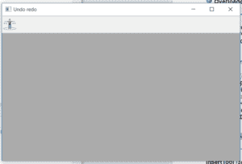
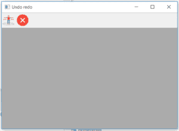
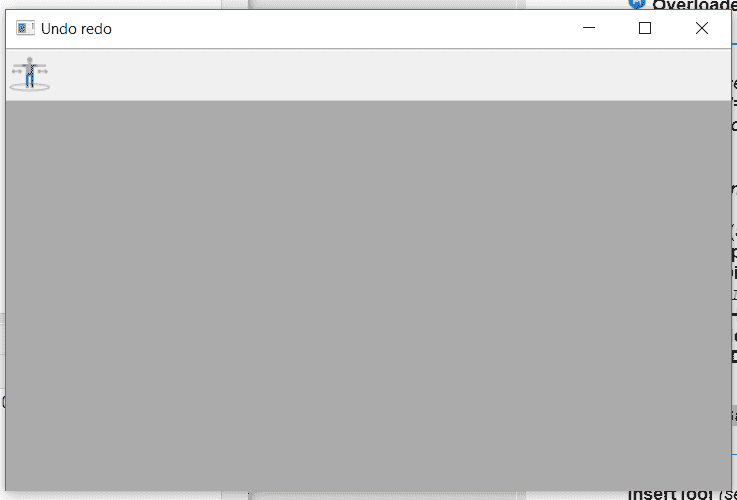
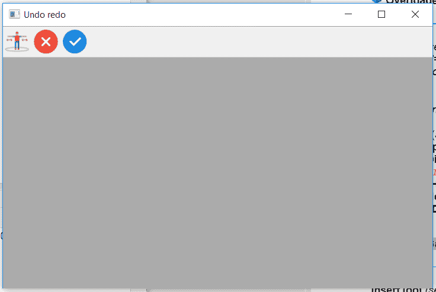

# wx Tyson–wx 中的 InsertTool()函数。工具栏

> 原文:[https://www . geesforgeks . org/wxpython-insert tool-function-in-wx-toolbar/](https://www.geeksforgeeks.org/wxpython-inserttool-function-in-wx-toolbar/)

在本文中，我们将学习与 wx 相关联的 InsertTool()函数。wxPython 的工具栏类。InsertTool()函数是在工具栏的特定位置插入工具的新样式。InsertTool()将与工具相关联的参数作为其参数。

> **语法:** wx。工具栏。插入工具(自身，位置，工具标识，标签，位图，bmpDisabled =空位图，种类=ITEM_NORMAL，shortHelp= "，longHelp= "，clientData=None)
> 
> **参数:**
> 
> | 参数 | 输入类型 | 描述 |
> | --- | --- | --- |
> | 刷卡机 | （同 Internationalorganizations）国际组织 | 从 0 开始添加工具的位置。 |
> | 椅子 | （同 Internationalorganizations）国际组织 | 一个整数，通过它可以在后续操作中识别工具。 |
> | 标签 | 线 | 工具要显示的字符串。 |
> | 位图 | wx .位图 | 主要工具位图。 |
> | bmpDisabled | wx .位图 | 工具禁用时使用的位图。 |
> | 种类 | （同 Internationalorganizations）国际组织 | 有点像工具栏。 |
> | 简短的帮助 | 线 | 该字符串用于工具提示。 |
> | longHelp | 线 | 与工具关联的详细字符串。 |
> | clientdate | 普塞达塔 | 一个指向客户端数据的可选指针，稍后可以使用 GetToolClientData 检索该指针。 |
> 
> **返回类型:**
> wx。工具栏工具库

**Code Example:**

```
import wx

class Example(wx.Frame):

    def __init__(self, *args, **kwargs):
        super(Example, self).__init__(*args, **kwargs)
        self.InitUI()

    def InitUI(self):
        self.locale = wx.Locale(wx.LANGUAGE_ENGLISH)
        self.toolbar = self.CreateToolBar()
        td = self.toolbar.AddTool(1, '', wx.Bitmap('sep.png'))

        self.toolbar.Realize()
        self.Bind(wx.EVT_TOOL, self.OnOne, td)

        self.SetSize((350, 250))
        self.SetTitle('Undo redo')
        self.Centre()

    def OnOne(self, e):
        # insert tool with id = 2
        self.toolbar.InsertTool(pos = 1, toolId = 2, label ='wrong',
                                   bitmap = wx.Bitmap('wrong.png'))
        self.toolbar.Realize()

    def OnQuit(self, e):
        self.Close()

def main():

    app = wx.App()
    ex = Example(None)
    ex.Show()
    app.MainLoop()

if __name__ == '__main__':
    main()
```

**输出:**
*点击前分开工具:*


*点击后分开工具:*


**代码示例:**

```
import wx

class Example(wx.Frame):

    def __init__(self, *args, **kwargs):
        super(Example, self).__init__(*args, **kwargs)
        self.InitUI()

    def InitUI(self):
        self.locale = wx.Locale(wx.LANGUAGE_ENGLISH)
        self.toolbar = self.CreateToolBar()
        td = self.toolbar.AddTool(1, '', wx.Bitmap('sep.png'))

        self.toolbar.Realize()
        self.Bind(wx.EVT_TOOL, self.OnOne, td)

        self.SetSize((350, 250))
        self.SetTitle('Undo redo')
        self.Centre()

    def OnOne(self, e):
        # insert two tools in one go
        self.toolbar.InsertTool(pos = 3, toolId = 2, label ='wrong', 
                                   bitmap = wx.Bitmap('wrong.png'))
        self.toolbar.InsertTool(pos = 4, toolId = 3, label ='right', 
                                    bitmap = wx.Bitmap('right.png'))
        self.toolbar.Realize()

    def OnQuit(self, e):
        self.Close()

def main():

    app = wx.App()
    ex = Example(None)
    ex.Show()
    app.MainLoop()

if __name__ == '__main__':
    main()
```

**输出:**
*点击前分开工具:*


*点击后分开工具:*
