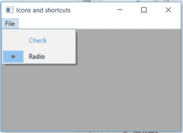

# wx xpython–wx 中的 IsCheckable()函数。菜单项

> 原文:[https://www . geeksforgeeks . org/wxpython-ischeckable-function-in-wx-menuitem/](https://www.geeksforgeeks.org/wxpython-ischeckable-function-in-wx-menuitem/)

在本文中，我们将学习与 wx 相关联的 IsCheckable()函数。wxPython 的 MenuItem 类。如果项目是可检查的，is checkable()函数返回 True。
请注意，单选按钮也被认为是可检查的，因此该方法也为它们返回 True。如果您只想测试检查项目，请使用 IsCheck。

> **语法:**
> 
> ```py
> wx.MenuItem.IsCheckable(self)
> 
> ```
> 
> **参数:**
> 
> ```py
> No parameters are required by IsCheckable() function.
> 
> ```
> 
> **返回类型:**
> 
> ```py
> bool
> 
> ```

**代码示例:**

```py
import wx

class Example(wx.Frame):

    def __init__(self, *args, **kwargs):
        super(Example, self).__init__(*args, **kwargs)

        self.InitUI()

    def InitUI(self):
        self.locale = wx.Locale(wx.LANGUAGE_ENGLISH)

        self.menubar = wx.MenuBar()
        self.fileMenu = wx.Menu()
        self.item = wx.MenuItem(self.fileMenu, 1, '&Check', helpString ="Check Help", kind = wx.ITEM_CHECK)
        self.item2 = wx.MenuItem(self.fileMenu, 2, '&Radio', helpString ="Check Help", kind = wx.ITEM_RADIO)
        self.item.SetBitmap(wx.Bitmap('right.png'))
        self.item.SetTextColour((79, 81, 230, 255))
        self.st = wx.StaticText(self, label ="", pos =(200, 200))
        self.fileMenu.Append(self.item)
        self.fileMenu.Append(self.item2)
        self.menubar.Append(self.fileMenu, '&File')
        self.SetMenuBar(self.menubar)
        # print 'Item is check' if kind = ITEM_CHECK or ITEM_RADIO
        if self.item.IsCheckable()== True:
            print("Item is check")
        else:
            print("Item is not check")
        if self.item2.IsCheckable() == True:
            print("Item is check")
        else:
            print("Item is not check")
        self.SetSize((350, 250))
        self.SetTitle('Icons and shortcuts')
        self.Centre()

def main():
    app = wx.App()
    ex = Example(None)
    ex.Show()
    app.MainLoop()

if __name__ == '__main__':
    main()
```

**输出:**

```py
Item is check
Item is check

```

**输出窗口:**
