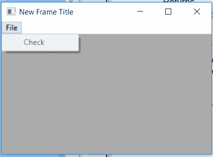

# wx 中的 wxPython–IsEnabled()函数。菜单栏

> 原文:[https://www . geesforgeks . org/wxpython-isenable d-function-in-wx-menu bar/](https://www.geeksforgeeks.org/wxpython-isenabled-function-in-wx-menubar/)

在本文中，我们将了解与 wx 相关联的 IsEnabled()函数。wxPython 的菜单栏类。IsEnabled()函数很有用，因为它决定了一个项目是否被启用。函数的作用是:如果找到该项目并启用，则返回真，否则返回假。

> **语法:** wx。菜单栏。启用(自我，身份)
> 
> **参数:**
> 
> | 参数 | 输入类型 | 描述 |
> | --- | --- | --- |
> | 身份证明（identification） | （同 Internationalorganizations）国际组织 | 菜单项标识符。 |

**代码示例:**

```py
import wx

class Example(wx.Frame):

    def __init__(self, *args, **kwargs):
        super(Example, self).__init__(*args, **kwargs)

        self.InitUI()

    def InitUI(self):

        self.locale = wx.Locale(wx.LANGUAGE_ENGLISH)
        self.menubar = wx.MenuBar()
        self.fileMenu = wx.Menu()
        self.fileMenu2 = wx.Menu()
        self.item = wx.MenuItem(self.fileMenu, 1, '&Check', helpString ="Check Help", 
                                                              kind = wx.ITEM_CHECK)
        self.item.SetBitmap(wx.Bitmap('right.png'))
        self.fileMenu.Append(self.item)

        # DISABLE MENU ITEM
        self.item.Enable(False)
        self.menubar.Append(self.fileMenu, '&File')
        self.SetMenuBar(self.menubar)
        self.SetSize((350, 250))
        self.SetTitle('New Frame Title')
        self.Centre()
        if(self.menubar.IsEnabled(1)== True):
            # print CLICKABLE if True
            print("CLICKABLE")
        else:
            # else print UNCLICKABLE
            print("UNCLICKABLE")

def main():
    app = wx.App()
    ex = Example(None)
    ex.Show()
    app.MainLoop()

if __name__ == '__main__':
    main()
```

**输出:**


**控制台输出:**

```py
UNCLICKABLE

```