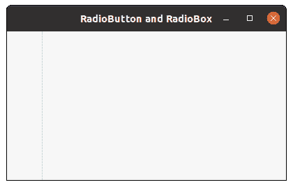

# wx Tyson–wx 中的 IsVertical()函数。静态线

> 原文:[https://www . geesforgeks . org/wxpython-is vertical-function-in-wx-static line/](https://www.geeksforgeeks.org/wxpython-isvertical-function-in-wx-staticline/)

在本文中，我们将学习与 wx 相关联的 IsVertical()方法。wxPython 的 StaticLine 类。IsVertical()函数是一个简单的函数，用于当直线垂直时返回 True，当直线水平时返回 False。

> **语法:** wx。静态线。静态(自)
> 
> **参数**IsVertical()方法不需要参数。
> 
> **返回类型:** bool

**代码示例:**

```
import wx

class FrameUI(wx.Frame):

    def __init__(self, parent, title):
        super(FrameUI, self).__init__(parent, title = title, size =(300, 200))

        # function for in-frame components
        self.InitUI()

    def InitUI(self):
        # parent panel for radio box
        pnl = wx.Panel(self)

        # list of choices
        hlist = ['Item One', 'Item Two']
        vlist =['Item One', 'Item Two']

        # create vertical line from point (50, 0) t0 (50, 250)
        self.sl = wx.StaticLine(pnl, 2,  pos =(50, 0), size = (1, 250), 
                                             style = wx.LI_VERTICAL)

        # print True if static line is vertical False otherwise
        print (self.sl.IsVertical())

        # set frame in centre
        self.Centre()
        # set size of frame
        self.SetSize((400, 250))
        # show output frame
        self.Show(True)

# wx App instance
ex = wx.App()
# Example instance
FrameUI(None, 'RadioButton and RadioBox')
ex.MainLoop()
```

**控制台输出:**

```
True
```

**输出窗口:**
