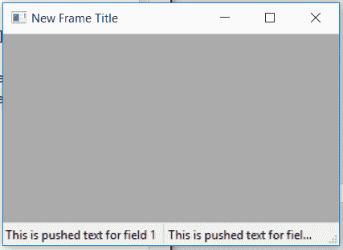

# wx xpython–wx 中的 PushStatusText()函数。状态栏

> 原文:[https://www . geesforgeks . org/wxpython-pushstatustext-function-in-wx-status bar/](https://www.geeksforgeeks.org/wxpython-pushstatustext-function-in-wx-statusbar/)

在本文中，我们将了解与 wx 相关联的 PushStatusText()函数。wxPython 的 StatusBar 类。PushStatusText()函数只是用来将当前字段文本保存在每个字段的堆栈中，并将字段文本设置为作为参数传递的字符串。
取字符串设置为状态文本和位置。

> **语法:** wx。StatusBar.PushStatusText(自身，字符串，字段=0)
> 
> **参数:**
> 
> | 参数 | 输入类型 | 描述 |
> | --- | --- | --- |
> | 线 | 线 | 要推入状态文本堆栈的字符串。 |
> | 领域 | （同 Internationalorganizations）国际组织 | 从 0 开始的字段位置。 |

**编码示例:**

```
import wx

class Example(wx.Frame):

    def __init__(self, *args, **kwargs):
        super(Example, self).__init__(*args, **kwargs)

        self.InitUI()

    def InitUI(self):

        self.locale = wx.Locale(wx.LANGUAGE_ENGLISH)
        self.statusbar = wx.StatusBar()
        self.statusbar.Create(self, id = 1, style = wx.STB_DEFAULT_STYLE,
                                                      name = "Status Bar")

        self.SetStatusBar(self.statusbar)
        self.SetSize((350, 250))

        self.statusbar.SetFieldsCount(2)
        self.statusbar.SetStatusWidths([150, 150])
        self.statusbar.SetStatusText("This is first field", 0)
        self.statusbar.SetStatusText("This is second field", 1)
        self.statusbar.SetStatusStyles(styles =[wx.SB_RAISED, wx.SB_SUNKEN])

        # PUSH TEXT IN STATUS TEXT STACK
        self.statusbar.PushStatusText(string ="This is pushed text for field 1", field = 0)
        self.statusbar.PushStatusText(string ="This is pushed text for field 2", field = 1)
        self.SetTitle('New Frame Title')
        self.Centre()

def main():
    app = wx.App()
    ex = Example(None)
    ex.Show()
    app.MainLoop()

if __name__ == '__main__':
    main()
```

**输出窗口:**
