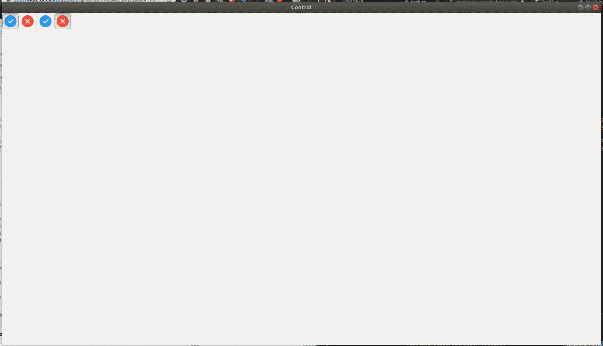

# wxPython–wx 中的 RadioGroups。工具栏

> 原文:[https://www . geesforgeks . org/wxpython-radio groups-in-wx-toolbar/](https://www.geeksforgeeks.org/wxpython-radiogroups-in-wx-toolbar/)

在本文中，我们将学习如何在工具栏中创建单选按钮组。在收音机组中，不同的收音机菜单由不同的收音机工具组成。在一个特定的无线菜单中，如果我们点击任何一个无线工具，它就会被选中，而其他无线工具会自动取消选中。

**步骤:**

**1。**我们将创建两个无线电工具。
T3】2。创建这些工具后，会创建一个分隔符。
**3。**在创建分离器之后，我们将创建另外两个无线电工具。
**4。**完成这些步骤后，我们将获得两个单选菜单。

**语法:**

```py
*various Radio Tools{Radio Menu}
Add Separator
various Radio Tools{Radio Menu}*

```

**Code Example:**

```py
import wx

class Example(wx.Frame):
    global count
    count = 0;
    def __init__(self, *args, **kwargs):
        super(Example, self).__init__(*args, **kwargs)

        self.InitUI()

    def InitUI(self):
        pnl = wx.Panel(self)
        self.toolbar = self.CreateToolBar()

        # Radio Tools
        ptool = self.toolbar.AddRadioTool(12, 'right', wx.Bitmap('/home/wxPython/right.png'),
                                                                     shortHelp ="Radio Tool")

        qtool = self.toolbar.AddRadioTool(13, 'right2', wx.Bitmap('/home/wxPython/wrong.png'),
                                                                     shortHelp ="Radio Tool")
        # Toolbar Separator 
        self.toolbar.AddSeparator()

        # Radio Tools
        rtool = self.toolbar.AddRadioTool(12, 'right', wx.Bitmap('/home/wxPython/right.png'), 
                                                                     shortHelp ="Radio Tool")

        stool = self.toolbar.AddRadioTool(13, 'right2', wx.Bitmap('/home/wxPython/wrong.png'),
                                                                     shortHelp ="Radio Tool")
        self.toolbar.Realize()
        self.SetSize((350, 250))
        self.SetTitle('Control')
        self.Centre()

def main():

    app = wx.App()
    ex = Example(None)
    ex.Show()
    app.MainLoop()

if __name__ == '__main__':
    main()
```

**输出:**

