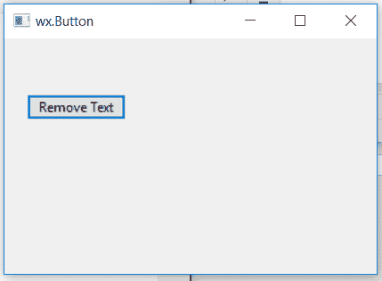

# wxPython–点击按钮

移除静态文本

> 原文:[https://www . geesforgeks . org/wxpython-remove-static-text-on-clicking-button/](https://www.geeksforgeeks.org/wxpython-remove-static-text-on-clicking-button/)

在本文中，我们将学习如何通过单击同一框架中的按钮来移除框架中的静态文本。
我们需要遵循一些步骤:

> **步骤 1:** 在框架中创建静态文本。
> **第一步:**在同一帧中创建一个按钮。
> **步骤 1:** 为按钮分配事件功能。
> **第四步:**使用 Destroy()功能销毁静态文本。

> **语法:** wx。毁灭(自我)
> 
> **参数:** Destroy()函数不接受参数。

**代码:**

```
import wx

class Example(wx.Frame):

    def __init__(self, *args, **kwargs):
        super(Example, self).__init__(*args, **kwargs)
        self.InitUI()

    def InitUI(self):
        self.locale = wx.Locale(wx.LANGUAGE_ENGLISH)

        # create parent panel
        self.pnl = wx.Panel(self)

        # create statictext at point (20, 20)
        self.st = wx.StaticText(self.pnl, id = 1, 
                    label ="Click button to remove", pos =(20, 20))

        # create button
        self.btn = wx.Button(self.pnl, id = 1, label ="Remove Text", pos =(20, 50))

        # bind Onclick() event function
        self.btn.Bind(wx.EVT_BUTTON, self.Onclick)

        self.SetSize((350, 250))
        self.SetTitle('wx.Button')
        self.Centre()

    def Onclick(self, e):
        # destroy static text
        self.st.Destroy()

def main():
    app = wx.App()
    ex = Example(None)
    ex.Show()
    app.MainLoop()

if __name__ == '__main__':
    main()
```

**输出窗口:**

*点击按钮*前


*后点击按钮*