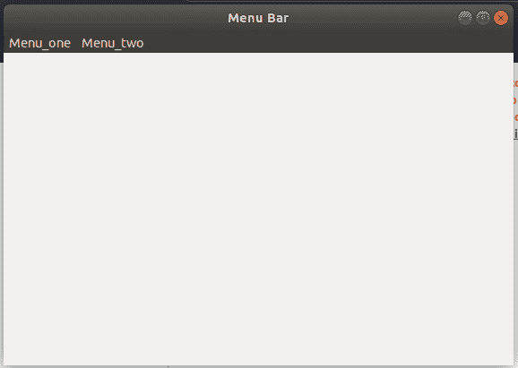
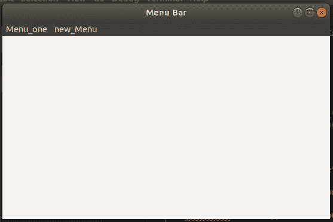

# wxPython–wxPython

中的 Replace()功能

> 原文:[https://www . geeksforgeeks . org/wxpython-replace-function-in-wxpython/](https://www.geeksforgeeks.org/wxpython-replace-function-in-wxpython/)

wx 中的另一个函数。菜单栏类是`Replace()`功能。如果我们想替换菜单栏中的菜单，我们可以使用 replace()函数。它需要三个主要参数，即我们想要替换的菜单的位置、我们想要添加的菜单、新菜单的标题。

> **语法:**
> 
> ```py
> wx.MenuBar.Replace(self, pos, menu, title)
> 
> ```
> 
> **参数:**
> 
> The title of the menu.
> 
> | 参数 | 输入类型 | 描述 |
> | --- | --- | --- |
> | 刷卡机 | （同 Internationalorganizations）国际组织 | 菜单栏中新菜单的位置 |
> | 菜单 | wx 菜单 | 要添加的菜单。 |

标题线The menu to add.

让我们创建一个有两个菜单项 Menu _ 1 和 Menu _ 2 的窗口。

**代码:**

```py
import wx

class Example(wx.Frame):

    def __init__(self, *args, **kw):
        super(Example, self).__init__(*args, **kw)

        # create MenuBar using MenuBar() function
        menubar = wx.MenuBar()

        # add menu to MenuBar
        fm1 = wx.Menu()
        fileitem = fm1.Append(20, "one")

        fm2 = wx.Menu()
        fileitem2 = fm2.Append(20, "two")
        menubar.Append(fm1, '&Menu_one')
        menubar.Append(fm2, '&Menu_two')
        self.SetMenuBar(menubar)
        self.SetSize((300, 200))
        self.SetTitle('Menu Bar')

def main():
    app = wx.App()
    ex = Example(None)
    ex.Show()
    app.MainLoop()

if __name__ == '__main__':
    main()
```

**窗口:**


现在让我们用新菜单替换菜单二。

**替换代码:**

```py
import wx

class Example(wx.Frame):

    def __init__(self, *args, **kw):
        super(Example, self).__init__(*args, **kw)

        # create MenuBar using MenuBar() function
        menubar = wx.MenuBar()

        # add menu to MenuBar
        fm1 = wx.Menu()
        fileitem = fm1.Append(20, "one")

        fm2 = wx.Menu()
        fileitem2 = fm2.Append(21, "two")
        fm3 = wx.Menu()
        fileitem3 = fm3.Append(22, "new")

        menubar.Append(fm1, '&Menu_one')
        menubar.Append(fm2, '&Menu_two')
        self.SetMenuBar(menubar)
        self.SetSize((300, 200))
        self.SetTitle('Menu Bar')
        menubar.Replace(1, fm3, "new_Menu")

def main():
    app = wx.App()
    ex = Example(None)
    ex.Show()
    app.MainLoop()

if __name__ == '__main__':
    main()
```

**输出:**
