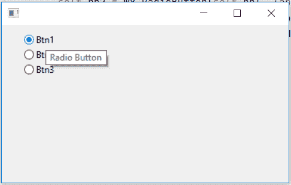

# wxPython–设置单选按钮的工具提示

> 原文:[https://www . geesforgeks . org/wxpython-set-tooltip-for-radio-button/](https://www.geeksforgeeks.org/wxpython-set-tooltip-for-radio-button/)

在本文中，我们将学习如何向单选按钮添加工具提示。我们将使用与 wx.RadioButton 关联的 SetToolTip()函数。
SetToolTip()函数将用作工具提示的字符串作为参数。

> **语法:** wx。单选按钮。设置工具提示(自身，字符串)
> 
> **参数:**
> 
> | 参数 | 输入类型 | 描述 |
> | --- | --- | --- |
> | 线 | 线 | 用作工具提示参数的字符串。 |

**代码示例:**

```py
import wx

APP_EXIT = 1

class Example(wx.Frame):

    def __init__(self, *args, **kwargs):
        super(Example, self).__init__(*args, **kwargs)

        self.InitUI()

    def InitUI(self):

        # parent panel for radio buttons
        self.pnl = wx.Panel(self)

        # create radio buttons
        self.rb1 = wx.RadioButton(self.pnl, label ='Btn1', pos =(30, 10), size =(100, 20))
        self.rb2 = wx.RadioButton(self.pnl, label ='Btn2', pos =(30, 30), size =(100, 20))
        self.rb3 = wx.RadioButton(self.pnl, label ='Btn3', pos =(30, 50), size =(100, 20))

        # set tooltip for radio button
        self.rb1.SetToolTip("Radio Button")

def main():
    app = wx.App()
    ex = Example(None)
    ex.Show()
    app.MainLoop()

if __name__ == '__main__':
    main()
```

**输出窗口:**
