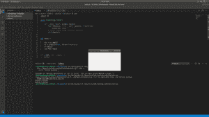
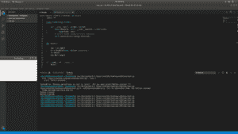

# wxPython–在屏幕中央设置窗口

> 原文:[https://www . geesforgeks . org/wxpython-set-屏幕中心窗口/](https://www.geeksforgeeks.org/wxpython-set-window-in-center-of-screen/)

在本文中，我们将学习如何在屏幕中央显示窗口。我们可以通过使用 wx 中的 Centre()函数来做到这一点。框架模块。

> **语法:**
> 
> ```py
> wx.Frame.Centre(self, direction = wx.BOTH)
> ```
> 
> **参数:**
> 
> <figure class="table">
> 
> | 参数 | 输入类型 | 描述 |
> | --- | --- | --- |
> | 方向 | （同 Internationalorganizations）国际组织 | 该参数可以是 wx。水平，wx。垂直或 wx.BOTH。 |
> 
> </figure>

**示例#1:**

## 蟒蛇 3

```py
# import wxPython
import wx

class Example(wx.Frame):

    def __init__(self, parent, title):

        super(Example, self).__init__(parent, title = title,
                                           size =(300, 200))

        # Centre frame using Centre() function
        self.Centre()

def main():

    app = wx.App()
    ex = Example(None, title ='Centering')
    ex.Show()
    app.MainLoop()

if __name__ == '__main__':
    main()
```

**输出:**



**例 2:**

## 蟒蛇 3

```py
# import wxPython
import wx

class Example(wx.Frame):

    def __init__(self, parent, title):
        super(Example, self).__init__(parent, title = title,
                                          size =(300, 200))

        # Centre frame using Centre() function
        self.Centre(direction = wx.VERTICAL)

def main():

    app = wx.App()
    ex = Example(None, title ='Centering')
    ex.Show()
    app.MainLoop()

if __name__ == '__main__':
    main()
```

**输出:**

