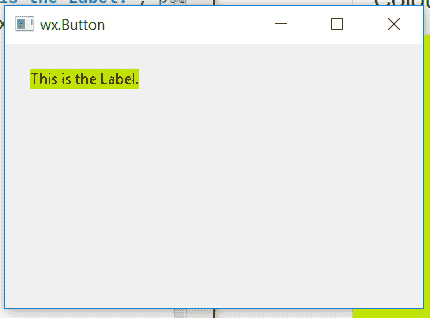

# wx Tyson–wx 中的 SetBackgroundColour()函数。StaticText

> 原文:[https://www . geesforgeks . org/wxpython-setbackground color-function-in-wx-static text/](https://www.geeksforgeeks.org/wxpython-setbackgroundcolour-function-in-wx-statictext/)

在本文中，我们将学习与 wx 相关的 SetBackgroundColour()函数。wxPython 的 StaticText 类。SetBackgroundColour()函数只是用来将静态文本的背景设置为不同的颜色。

它需要 wx。设置背景颜色的颜色参数。

> **语法:** wx。设置背景颜色(自身，颜色)
> 
> **参数:**
> 
> | 参数 | 输入类型 | 描述 |
> | --- | --- | --- |
> | 颜色 | wx。颜色 | 静态文本的背景颜色。 |

**代码示例:**

```py
import wx

class Example(wx.Frame):

    def __init__(self, *args, **kwargs):
        super(Example, self).__init__(*args, **kwargs)
        self.InitUI()

    def InitUI(self):
        self.locale = wx.Locale(wx.LANGUAGE_ENGLISH)
        self.pnl = wx.Panel(self)

        bmp = wx.Bitmap('right.png')
        # CREATE STATICTEXT AT POINT (20, 20)
        self.st = wx.StaticText(self.pnl, id = 1, label ="This is the Label.", 
                                pos =(20, 20), size = wx.DefaultSize, 
                                style = wx.ST_ELLIPSIZE_MIDDLE, name ="statictext")

        # SET BACKGROUND COLOUR TO YELLOW
        self.st.SetBackgroundColour((215, 252, 3, 255))
        self.SetSize((350, 250))
        self.SetTitle('wx.Button')
        self.Centre()

def main():
    app = wx.App()
    ex = Example(None)
    ex.Show()
    app.MainLoop()

if __name__ == '__main__':
    main()
```

**输出窗口:**
