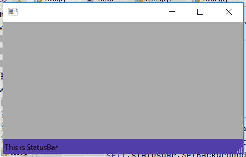

# wx Tyson–wx 中的 SetBackgroundColour()函数。状态栏

> 原文:[https://www . geesforgeks . org/wxpython-setbackground color-function-in-wx-status bar/](https://www.geeksforgeeks.org/wxpython-setbackgroundcolour-function-in-wx-statusbar/)

在本文中，我们将学习与 wx 相关的 SetBackgroundColour()函数。wxPython 的 StatusBar 类。SetBackgroundColour()函数用于设置状态栏背景的颜色。它需要 wx。以颜色作为论据。

> **语法:** wx。状态栏。设置背景颜色(自身，颜色)
> 
> **参数:**
> 
> | 参数 | 输入类型 | 描述 |
> | --- | --- | --- |
> | 颜色 | wx。颜色 | 背景颜色。 |

**代码示例:**

```
import wx

class Example(wx.Frame):

    def __init__(self, *args, **kwargs):
        super(Example, self).__init__(*args, **kwargs)

        self.InitUI()

    def InitUI(self):

        self.locale = wx.Locale(wx.LANGUAGE_ENGLISH)
        self.statusbar = wx.StatusBar(self, id = 1, 
              style = wx.STB_DEFAULT_STYLE, name ="sb")
        self.statusbar.SetStatusText("This is StatusBar")
        self.statusbar.SetBackgroundColour((80, 60, 170, 230))

        self.SetStatusBar(self.statusbar)

def main():
    app = wx.App()
    ex = Example(None)
    ex.Show()
    app.MainLoop()

if __name__ == '__main__':
    main()
```

**输出窗口:**
