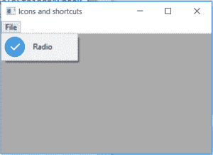

# wxPython–wxPython

中的 SetBitmap()函数

> 原文:[https://www . geeksforgeeks . org/wxpython-set bitmap-function-in-wxpython/](https://www.geeksforgeeks.org/wxpython-setbitmap-function-in-wxpython/)

在本文中，我们将学习与 wx 相关的 SetBitmap()函数。wxPython 的 MenuItem 类。SetBitmap()设置菜单项的位图。在将项目追加到菜单之前，必须调用 SetBitmap，即追加没有位图的项目，并不能保证以后设置位图。但是位图可以在以后更改或重置，如果它是最初设置的话。

> **语法:**
> 
> ```
> wx.SetBitmap
> 
> ```
> 
> **参数:**
> 
> | 参数 | 输入类型 | 描述 |
> | --- | --- | --- |
> | 位图文件的扩展名 | wx(地名)。点阵图(Bitmap) | 为菜单项设置的位图。 |
> | 检查 | 弯曲件 | 为真表示选中，为假表示取消选中。 |

**代码示例:**

```
import wx

class Example(wx.Frame):

    def __init__(self, *args, **kwargs):
        super(Example, self).__init__(*args, **kwargs)

        self.InitUI()

    def InitUI(self):
        self.locale = wx.Locale(wx.LANGUAGE_ENGLISH)
        self.menubar = wx.MenuBar()
        self.fileMenu = wx.Menu()
        self.item = wx.MenuItem(self.fileMenu, 1, '&Radio', helpString ="Check Help")
        # set bitmap for tool
        self.item.SetBitmap(bmp = wx.Bitmap('right.png'), checked = True)
        self.fileMenu.Append(self.item)
        self.menubar.Append(self.fileMenu, '&File')
        self.SetMenuBar(self.menubar)
        self.SetSize((350, 250))
        self.SetTitle('Icons and shortcuts')
        self.Centre()

def main():
    app = wx.App()
    ex = Example(None)
    ex.Show()
    app.MainLoop()

if __name__ == '__main__':
    main()
```

**输出窗口:**
