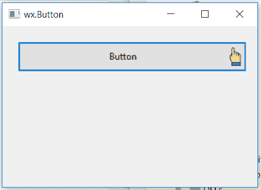

# wx xpython–wx 中的 SetBitmapPosition()函数。按钮

> 原文:[https://www . geesforgeks . org/wxpython-setbitmapposition-function-in-wx-button/](https://www.geeksforgeeks.org/wxpython-setbitmapposition-function-in-wx-button/)

在本文中，我们将了解与 wx 相关联的 SetBitmapPosition()函数。wxPython 的按钮类。SetBitmapPosition()函数用于设置位图中要设置的方向。

**方向:**
**1。** wx。左
**2。** wx。右
**3。** wx。底部
**3。** wx。顶端

> **语法:** wx。Button.SetBitmapPosition(self，dir)
> 
> **参数:**
> 
> | 参数 | 输入类型 | 描述 |
> | --- | --- | --- |
> | 目录 | 方向 | 位图应该定位的方向，wx 之一。左，wx。对，wx。TOP 或 wx . BOOTH。 |

**代码示例:**

```
import wx

class Example(wx.Frame):

    def __init__(self, *args, **kwargs):
        super(Example, self).__init__(*args, **kwargs)
        self.InitUI()

    def InitUI(self):
        self.locale = wx.Locale(wx.LANGUAGE_ENGLISH)

        # create parent panel for button
        self.pnl = wx.Panel(self)

        # create bitmap
        bmp = wx.Bitmap('pointer.png')

        # create button at point (20, 20)
        self.st = wx.Button(self.pnl, id = 1, label ="Button", pos =(20, 20),
                                          size =(300, 40),  name ="button")

        # set bitmap for button
        self.st.SetBitmap(bmp)

        # change position of bitmap to right
        self.st.SetBitmapPosition(wx.RIGHT)

        self.SetSize((350, 250))
        self.SetTitle('wx.Button')
        self.Centre()

def main():
    app = wx.App()
    ex = Example(None)
    ex.Show()
    app.MainLoop()

if __name__ == '__main__':
    main()
```

**输出窗口:**
