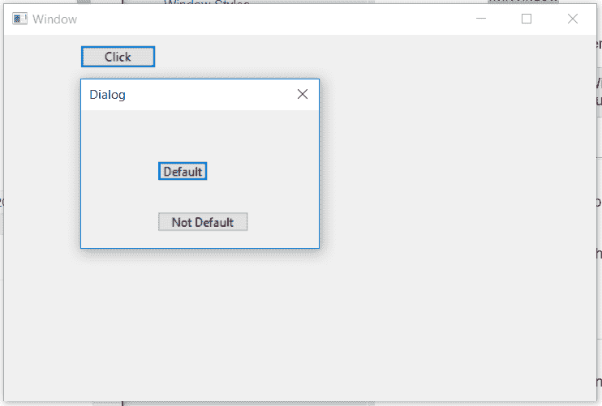

# wx Tyson–wx 中的 SetDefault()函数。按钮

> 原文:[https://www . geesforgeks . org/wxpython-set default-function-in-wx-button/](https://www.geeksforgeeks.org/wxpython-setdefault-function-in-wx-button/)

在本文中，我们将学习与 wx 相关联的 SetDefault()函数。wxPython 的按钮类。这将按钮设置为其顶层窗口(例如面板或包含它的对话框)中的默认项目。
正常情况下，按下 return 键会导致默认按钮在按下 return 键时被按下。

> **语法:** wx。按钮。设置默认值(自身)
> 
> **参数:**无参数
> 
> **返回类型:** wx。窗户

**代码示例:**

```py
import wx

class MyDialog(wx.Dialog):
    def __init__(self, parent, title):
        super(MyDialog, self).__init__(parent, title = title, size =(250, 175))
        panel = wx.Panel(self)
        self.btn = wx.Button(panel, wx.ID_OK, label ="Default",
                                  size =(50, 20), pos =(75, 50))
        self.btn1 = wx.Button(panel, wx.ID_OK, label ="Not Default",
                                     size =(90, 20), pos =(75, 100))

class Mywin(wx.Frame):

    def __init__(self, parent, title):
        super(Mywin, self).__init__(parent, title = title, size =(250, 150))
        self.InitUI()

    def InitUI(self):
        panel = wx.Panel(self)
        btn = wx.Button(panel, label ="Click", pos =(75, 10))
        btn.Bind(wx.EVT_BUTTON, self.OnModal)
        # SET BUTTON AS DEFAULT
        btn.SetDefault()

        self.SetMinSize((600, 400))
        self.Centre()
        self.Show(True)

    def OnModal(self, event):
        a = MyDialog(self, "Dialog").ShowModal()

ex = wx.App()
Mywin(None, 'Window')
ex.MainLoop()
```

**输出窗口:**
