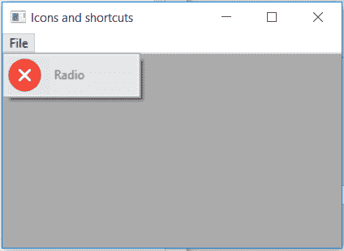

# wx python–wx 中的 SetDisabledBitmap()函数。MenuItem

> 哎哎哎:# t0]https://www . geeksforgeeks . org/wx python-setdisabledbitmap-function-in-wx-menu item/

在本文中，我们将了解与 wx 相关联的 SetDisabledBitmap()函数。wxPython 的 MenuItem 类。SetDisabledBitmap()函数用于简单地设置要用于禁用菜单项的位图。它对禁用的项目采用单一位图参数。

> **语法:**
> 
> ```py
> wx.MenuItem.SetDisabledItem(self, disabled)
> 
> ```
> 
> **参数:**
> 
> | 参数 | 输入类型 | 描述 |
> | --- | --- | --- |
> | 有缺陷的 | wx(地名)。点阵图(Bitmap) | 为禁用的菜单项设置的位图。 |

**代码示例:**

```py
import wx

class Example(wx.Frame):

    def __init__(self, *args, **kwargs):
        super(Example, self).__init__(*args, **kwargs)

        self.InitUI()

    def InitUI(self):
        self.locale = wx.Locale(wx.LANGUAGE_ENGLISH)
        self.menubar = wx.MenuBar()
        self.fileMenu = wx.Menu()
        self.item = wx.MenuItem(self.fileMenu, 1, '&Radio', helpString ="Check Help", kind = wx.ITEM_CHECK)
        self.item.SetBitmap(bmp = wx.Bitmap('right.png'))
        # set bitmap for menuitem while disabled
        self.item.SetDisabledBitmap(wx.Bitmap('wrong.png'))
        self.item.Enable(False)
        self.fileMenu.Append(self.item)
        self.menubar.Append(self.fileMenu, '&File')
        self.SetMenuBar(self.menubar)
        self.SetSize((350, 250))
        self.SetTitle('Icons and shortcuts')
        self.Centre()

def main():
    app = wx.App()
    ex = Example(None)
    ex.Show()
    app.MainLoop()

if __name__ == '__main__':
    main()
```

**输出:**
