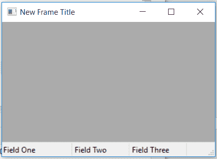

# wx Tyson–wx 中的 SetFieldsCount()函数。状态栏

> 原文:[https://www . geesforgeks . org/wxpython-setfield scount-function-in-wx-status bar/](https://www.geeksforgeeks.org/wxpython-setfieldscount-function-in-wx-statusbar/)

在本文中，我们将学习与 wx 相关联的 SetFieldsCount()函数。wxPython 的 StatusBar 类。SetFieldsCount()函数只是用来设置字段的数量，也可以选择设置字段的宽度。
需要设置字段的两个参数编号和对应字段的宽度列表。

> **语法:** wx。StatusBar.SetFieldsCount(自身，数字=1，宽度=无)
> 
> **参数:**
> 
> | 参数 | 输入类型 | 描述 |
> | --- | --- | --- |
> | 数字 | （同 Internationalorganizations）国际组织 | 字段的数量。如果这个数字大于前一个数字，那么带有空字符串的新字段将被添加到状态栏中。 |
> | 宽度 | 国际号码列表 | n 个整数的数组，其解释方式与 SetStatusWidths 相同。 |

**代码示例:**

```py
import wx

class Example(wx.Frame):

    def __init__(self, *args, **kwargs):
        super(Example, self).__init__(*args, **kwargs)

        self.InitUI()

    def InitUI(self):

        self.locale = wx.Locale(wx.LANGUAGE_ENGLISH)
        self.statusbar = wx.StatusBar()
        self.statusbar.Create(self, id = 1, style = wx.STB_DEFAULT_STYLE,
                                                     name = "Status Bar")
        self.SetStatusBar(self.statusbar)
        self.SetSize((350, 250))

        # SET TOTAL NUMBER OF FIELDS AND RESPECTIVE WIDTHS
        self.statusbar.SetFieldsCount(3, [100, 80, 60])

        # SET TEXT FOR ALL FIELDS
        self.statusbar.SetStatusText("Field One", 0)
        self.statusbar.SetStatusText("Field Two", 1)
        self.statusbar.SetStatusText("Field Three", 2)

        self.SetTitle('New Frame Title')
        self.Centre()

def main():
    app = wx.App()
    ex = Example(None)
    ex.Show()
    app.MainLoop()

if __name__ == '__main__':
    main()
```

**输出窗口:**
