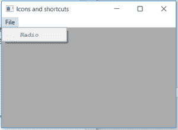

# wxppython–setfont()wx 中的函数。MenuItem

> 原文:[https://www . geesforgeks . org/wxpython-set font-function-in-wx-menuitem/](https://www.geeksforgeeks.org/wxpython-setfont-function-in-wx-menuitem/)

在本文中，我们将学习与 wx 相关的 SetFont()函数。wxPython 的 MenuItem 类。SetFont()函数用于设置菜单项关联的字体。
以字体为参数，为 wx。字体对象。

> **语法:**
> 
> ```
> wx.MenuItem.SetFont(self, font)
> 
> ```
> 
> **参数:**
> 
> | 参数 | 输入类型 | 描述 |
> | --- | --- | --- |
> | 字体 | wx(地名)。字体(t) | 为菜单项设置的字体。 |

**代码示例:**

```
import wx

class Example(wx.Frame):

    def __init__(self, *args, **kwargs):
        super(Example, self).__init__(*args, **kwargs)

        self.InitUI()

    def InitUI(self):
        # CREATE FONT 
        fnt = wx.Font(pointSize = 8, family = wx.FONTFAMILY_MODERN, style = wx.FONTSTYLE_ITALIC, weight = wx.FONTWEIGHT_BOLD)
        self.locale = wx.Locale(wx.LANGUAGE_ENGLISH)
        self.menubar = wx.MenuBar()
        self.fileMenu = wx.Menu()
        self.item = wx.MenuItem(self.fileMenu, 1, '&Radio', helpString ="Check Help", kind = wx.ITEM_CHECK)
        # SET FONT FOR MENU ITEM self.item
        self.item.SetFont(fnt)
        self.item.Enable(False)
        self.fileMenu.Append(self.item)
        self.menubar.Append(self.fileMenu, '&File')
        self.SetMenuBar(self.menubar)
        self.SetSize((350, 250))
        self.SetTitle('Icons and shortcuts')
        self.Centre()

def main():
    app = wx.App()
    ex = Example(None)
    ex.Show()
    app.MainLoop()

if __name__ == '__main__':
    main()
```

**输出:**
