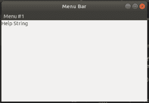

# wx xpython–wx 中的 SetHelpString()函数。菜单栏

> 原文:[https://www . geeksforgeeks . org/wxpython-set help string-function-in-wx-menu bar/](https://www.geeksforgeeks.org/wxpython-sethelpstring-function-in-wx-menubar/)

在本文中，我们将学习 wx 类的另一个函数。wxPython 中的菜单栏，即 SetHelpString()。设置帮助字符串将帮助字符串与菜单项相关联，该菜单项进一步用于各种目的。

> **语法:**
> 
> ```py
> wx.MenuBar.SetHelpString(self, id, helpString)
> 
> ```
> 
> **参数:**
> 
> | 参数 | 输入类型 | 描述 |
> | --- | --- | --- |
> | 身份证明（identification） | （同 Internationalorganizations）国际组织 | “项目标识符”菜单。 |
> | 帮助字符串 | 线 | 与菜单项关联的帮助字符串。 |

**代码示例:**

```py
import wx

class Example(wx.Frame):

    def __init__(self, *args, **kwargs):
        super(Example, self).__init__(*args, **kwargs)

        self.InitUI()

    def InitUI(self):
        # create MenuBar using MenuBar() function
        menubar = wx.MenuBar()

        # add menu to MenuBar
        fm1 = wx.Menu()
        fileitem = fm1.Append(20, "Item # 1")
        menubar.Append(fm1, '&Menu # 1')
        self.SetMenuBar(menubar)
        self.SetSize((300, 200))
        self.SetTitle('Menu Bar')

        # set helpstring using SetHelpString() function
        menubar.SetHelpString(20, "Help String")
        st = wx.StaticText(self, label ="click Item # 1 in Menu # 1")
        print(menubar.GetHelpString(20))

def main():
    app = wx.App()
    ex = Example(None)
    ex.Show()
    app.MainLoop()

if __name__ == '__main__':
    main()
```

**输出:**

