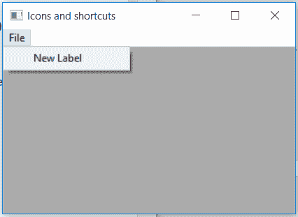

# wxppython–settemlabel()wx 中的函数。MenuItem

> 原文:[https://www . geesforgeks . org/wxpython-setitem label-function-in-wx-menuitem/](https://www.geeksforgeeks.org/wxpython-setitemlabel-function-in-wx-menuitem/)

在本文中，我们将学习与 wx 相关联的 SetItemLabel()函数。wxPython 的 MenuItem 类。SetItemLabel()函数用于设置菜单中与菜单项关联的标签。
注意，如果该菜单项的 ID 对应一个股票 ID，那么就不需要指定标签:wxWidgets 会自动使用与该 ID 关联的股票项目标签。有关更多信息，请参见构造函数。

> **语法:**
> 
> ```py
> wx.MenuItem.SetItemLabel(self, label)
> 
> ```
> 
> **参数:**
> 
> | 参数 | 输入类型 | 描述 |
> | --- | --- | --- |
> | 标签 | 线 | menuitem 的新标签。 |

**代码示例:**

```py
import wx

class Example(wx.Frame):

    def __init__(self, *args, **kwargs):
        super(Example, self).__init__(*args, **kwargs)

        self.InitUI()

    def InitUI(self):
        self.locale = wx.Locale(wx.LANGUAGE_ENGLISH)
        self.menubar = wx.MenuBar()
        self.fileMenu = wx.Menu()
        self.st = wx.StaticText(self, label ="", pos =(20, 20),
                                         style = wx.ALIGN_LEFT)
        self.item = wx.MenuItem(self.fileMenu, 1, '&Radio',
                                     kind = wx.ITEM_CHECK)

        # initial label of item is Radio
        # set new label of menu item
        self.item.SetItemLabel(label ="New Label")

        self.fileMenu.Append(self.item)
        self.menubar.Append(self.fileMenu, '&File')
        self.SetMenuBar(self.menubar)
        self.SetSize((350, 250))
        self.SetTitle('Icons and shortcuts')
        self.Centre()

def main():
    app = wx.App()
    ex = Example(None)
    ex.Show()
    app.MainLoop()

if __name__ == '__main__':
    main()
```

**输出:**
